```{r setup, include=FALSE}
knitr::opts_chunk$set(echo = TRUE,results=TRUE, message = FALSE, 
                      warning=FALSE, fig.align="center", cache=FALSE, eval = FALSE)
options(scipen=99)
```

[Return to MUSA 801 Projects Page](https://pennmusa.github.io/MUSA_801.io/)

This project was produced as part of the University of Pennsylvania’s Master of Urban Spatial Analytics Spring 2021 Practicum (MUSA 801) taught by Ken Steif, Michael Fichman, and Matt Harris. We would like to thank the Philadelphia Fire Department for providing useful information and data.

The following document is intended to present the methodology of an analysis of property fire risk in Philadelphia and an API tool that aims to improve the fire department’s situational awareness. This new API tool can provide real-time information and assessment for all parcels in the city. This document also includes detailed codes for building the risk assessment model and the situational awareness API.

# Introduction

## Motivation

Structure fire is one of the most common yet destructive urban disasters. On Nov. 21, 2020, two children were killed in a rowhome fire in Philadelphia’s Grays Ferry neighborhood despite rescue efforts by Philadelphia firefighters and desperate neighbors. The fire was reported at about 1:15 a.m. Although firefighters responded within two minutes, the row home was consumed by fire when they arrived. 

https://whyy.org/articles/despite-desperate-rescue-attempt-10-year-old-and-3-year-old-killed-in-south-philly-fire/


It is not yet known if the home had working smoke detectors, but the fire risk for each building is not the same. In a recent study, conducted by American Survey CO, for the period of 2005 - 2010, the causes of house fires across America were as follows:

* Appliances and electrical (stoves, microwaves, toasters, radiators, various heating systems, small appliances) - approximately 47%
* Gas leaks - around 5-7%
* Open flames (candles, fireplaces) - approximately 32%
* Children playing with matches - around 10%
* Spreading of fires from house to house - approximately 3%

Besides those immediate cause of fire, there are other factors that are important to fire risk prediction and worth fire fighter awareness. For instance, code violation and 311 requests can be a vital factor for fire risk, for fire is more likely to break out and to spread in run-down neighborhoods. 

## Use Case

Every day, The Philadelphia Fire Department responds to hundreds or even thousands of locations to deal with an array of emergencies. Currently, the Fire Department has little ‘situational awareness’ of fire risk for a given location when an emergency call comes in. In this project, we aim to improve this situation by creating a new API tool, which can return two deliverables for each property in the city:

* Parcel-level information for the building on fire and surrounding buildings 
* Parcel-level (building) fire risk assessment based on the city’s existing open datasets and past fire events

In addition, we want to let residents get a real-time update of the fire risk of their houses so they will have a situational awareness on risk for each property citywide.

**Fire Response Situational Awareness API:**

http://3.22.171.167:8000/parcel_info?addr=1200%20W%20VENANGO%20ST

"1200%20W%20VENANGO%20ST" here can be replaced by any street address in Philadelphia and is not necessary to be URL-encoded.

### What is an API?

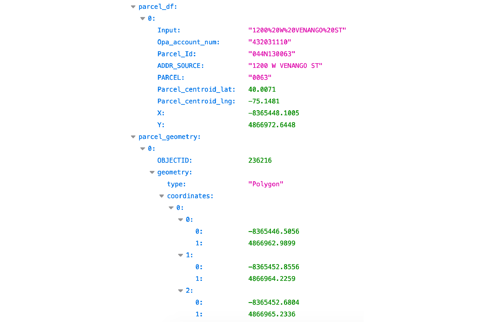

API is the acronym for Application Programming Interface, which is an interface that defines interactions between multiple software applications or mixed hardware-software intermediaries. It defines the kinds of calls or requests that can be made, how to make them, the data formats that should be used, the conventions to follow, etc.[Wikipedia-API] When someone uses an application on his or her device, the application connects to the Internet and sends data to a server. The server then retrieves that data, interprets it, performs the necessary actions and sends it back to the device. The application then interprets that data and presents the information in a readable way. That’s how API is used in our daily life.

**API- How does it work?**
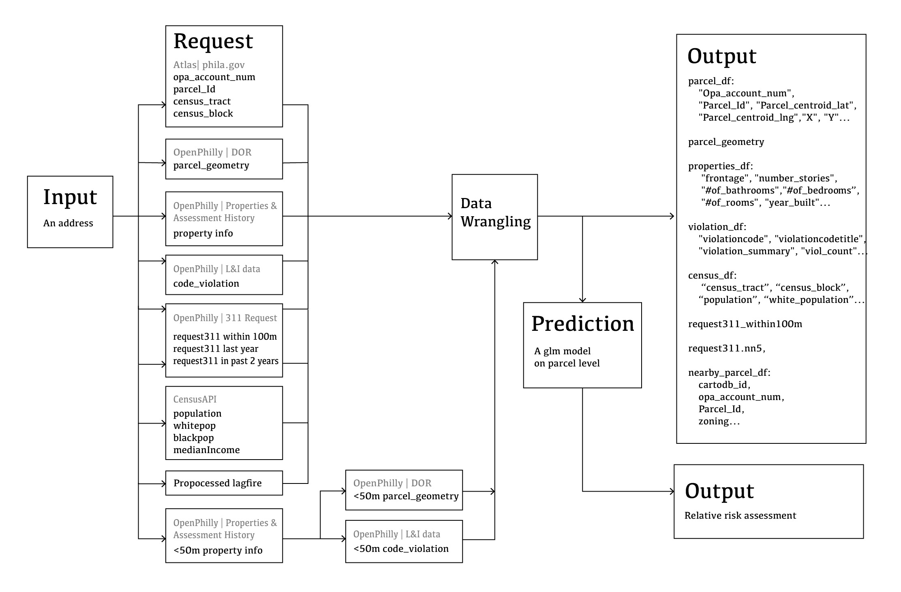

The diagram above shows how our API works. Once getting an input, it automatically grabs data elsewhere, deals with it and gives back a response to us. All the data we use is from diffuse data sources belonging to the city. The challenge here is figuring out how to get and combine all the data we need, structure it, make a relative fire risk assessment based on it and present them all in an API response.

**API- How was it built?**

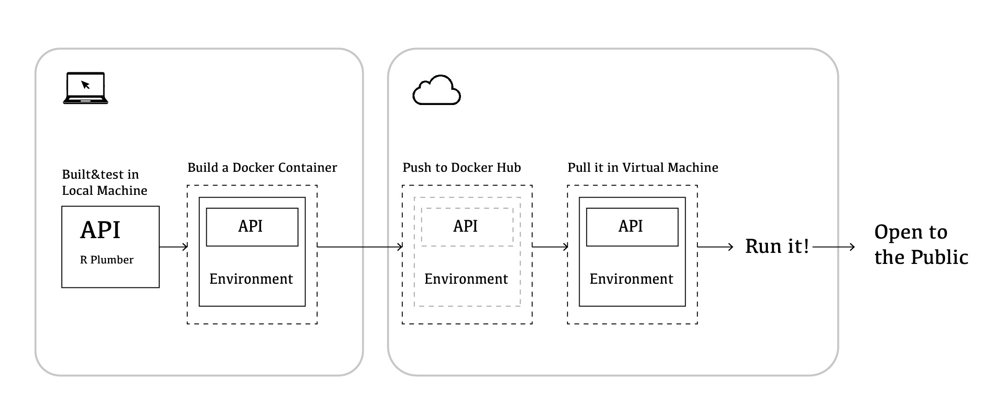

The API was built in R using Plumber[See appendix]. Once built, it serves locally in our own machines. Then we built a container which contains the API and the environment, push it to the cloud. At last, we pull the container in a virtual machine, run it and open it to the public.

### Why do we suggest using it?

First, the API we built provides real-time data. It requests the latest data only when getting an input. When you use it next time, it will request data again, giving back a new response without using the old one.

Second, the API integrates data from diffuse data sources of the city. It’s convenient to use it because it gives us all the information we want in only one request.

Third, the API provides clean data for us. It means the API gives back data without redundant or irrelevant information. It also structures it to make the response highly readable.

Last but not least, the API can be used for developments of multiple apps without causing any conflict. Apps in different usages can use the same API to get data.

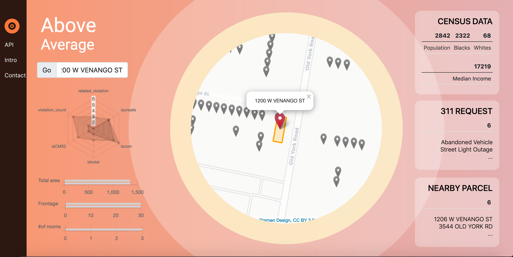


# Exploratory Analysis

## Data Wrangling

We used data retrievd from different sources to build dataset for modeling, which includes fire data from the Philadelphia Fire Department; Property Assessments, Licensing and Inspection Code Violations, 311 Service and Information Requests from OpenDataPhilly; and Socioeconomic and Demographic Data through 5-year American Community Survey APIs.

The data was also “wrangled” before being explored in the following section, in order to optimize predictive ability of each variable. For details on this procedure, please see Appendix: Data Wrangling. Since the fire risk is considered on parcel level, we joined multi-source dataset using unique identifiers OPA number or parcel registry number & address (the relationship of data is shown in the plot below). Once the wrangling and exploratory analysis process were complete, we were left with a dataset of about 490,000 individual parcels, which includes a “universe” of fire, property, risk factor information.


## Feature Engineering

We organized the data into four different categories of features which we anticipated would influence the risk of fire for each parcel city wide. This is done to ensure our model is sensitive to a diverse range of variables.

**1.Previous fire**

*Hypothesis 1: Is previous fire occurrence spatially correlated with risk of fire?*

We calculated the average distance from each parcel centroid to 5 nearest fire accidents to see if there are spatial patterns in fire occurrence. This variable can show us whether there are any clustering patterns, the idea being that fire events may be likely to happen in surrounding parcels with certain features.

**2.Demographics**

*Hypothesis 2: Are demographic characteristics correlated with fire accidents?*

We wanted to see if demographic characteristics were also linked to fire accidents in Philadelphia. For example, if areas with higher population are more likely to have fire occurrence since it would introduce more human factors? 

We also assigned each property to its neighborhood and census tract to see if, at a different scale, there is a spatial clustering of fire accidents that varies from neighborhood to neighborhood or tract to tract.

**3.Property attributes **

*Hypothesis 3: Could property attributes relate to the risk of fire?*

We wanted to see if the physical characteristics of a house would be correlated with fire accidents. We looked almost exclusively at the property dataset, and then focused on zoning type, category, and housing condition.

**4.Risk factors **

*Hypothesis 4: Does the presence of risk factors affect risk of fire?*

The risk factors here refer to the unsafety in the property itself and neighborhood blight features. Violation and 311 request data were used in this part to identify the risk factors.

As to the risk factor of property itself, unsafe structures or a lack of fire related equipment in the property are carefully analyzed, since the presence of such structures or problems could certainly add to the risk of fire.

In addition, we want to explore if adjacent to neighborhood blight/risk factors matter. Features like average distance to nearest broken street light request, no heat houses, and violation were analyzed.


Following part is our exploratory data analysis. In our analysis, the dependent variable is a binary outcome - either a parcel had a fire accidents or it wasn’t. In this case, the relevant question is whether for a given feature, there is a statistically significant difference between areas that caught a fire and areas that did not. These differences are explored in a set of plots below.

## Previous Fire

### How have fire events changed over time and what is the most common types?

The recordings of fire accidents have increased a lot in 2018. This may be due to the change in the procedure for recording fires after 2017. in 2020, the number of fire events decreased. Considering the outbreak of the COVID 19, it seems reasonable. The plot on the right shows the most common types of building fire. Since we had sum up the fire events information to the parcel level, we left out the wildfire.

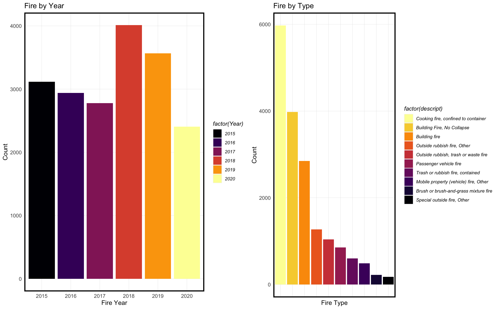

### What's the spatial correlation of fire incidents?

To examine if fires have a tendency to cluster in Philadelphia, we examined the average distance to 5 nearest previous fire events for each parcel. The result indicates that buildings with a smaller distance to past fires have a higher risk for future fire event.

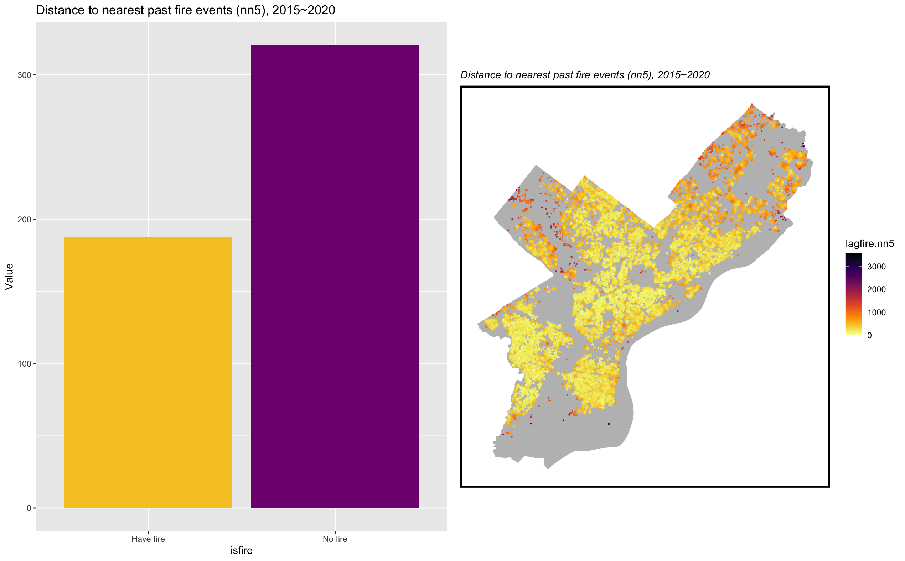

## Are demographic characteristics correlated with fire accidents?

We supposed that demographic variables would help us identify the distribution of fire events. Thus we analyzed the correlation between population, median household income, percentage of white population v.s. and the count of fire accidents in census tracts.

The result indicate that there are more fire accidents in the low-income or high population density neighborhood.

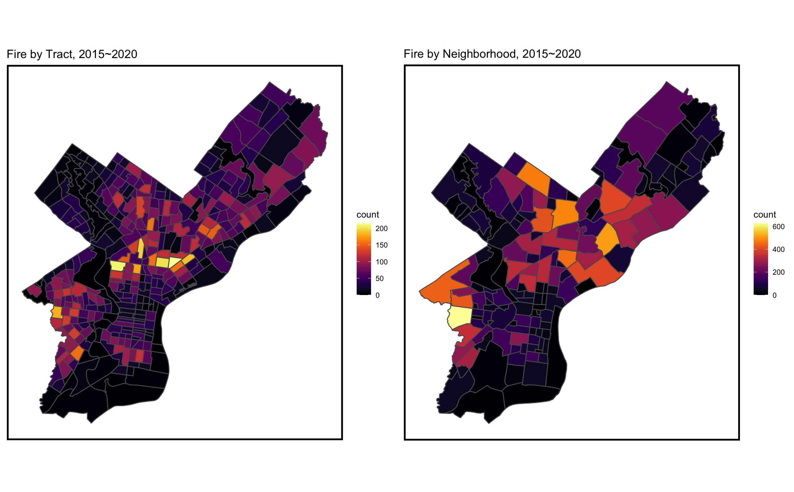

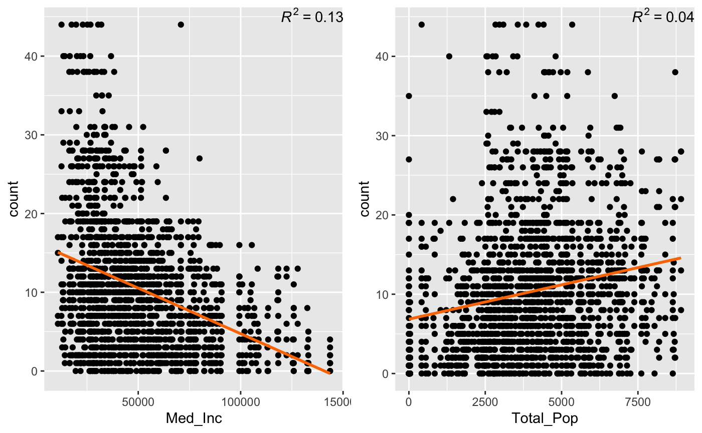

## Could property attributes relate to the risk of fire?

Next, we looked into all the parcels in Philadelphia to examine whether there is a higher percentage of fire occurrence in the properties with certain features.

According to the analysis, there is a higher percentage of fire occurrence in parcels with commercial or hotels and apartments properties. There is also a higher proportion of fire occurred in the parcels with buildings of RM1/CMX2 category, which stand for Residential Multi-Family Districts and Neighborhood Commercial Mixed-Use Districts.


## Does the presence of risk factors affect risk of fire?

### Violation

License and Inspection violations can be important risk factors. Multiple variables were created here, such as the count of violation on one parcel, whether there’s interior or exterior violation, whether there’s fire related violation. We specially analyzed two different L&I violations were here:

* Unsafe Structures

Unsafe building structures are found to be dangerous to property or its occupants because it does not provide minimum safeguards for protection from fire. The presence of such structures could add to the risk of fire in the parcel.

* broken or lack of fire equipment

Fire equipment like smoke alarms or fire extinguisher are important to prevent fire accidents. Broken or lack of fire equipment would increase the risk of fire.
The charts show that fire occurrences are obviously more prevalent in the parcels that had unsafe structure or had problems with fire equipment.

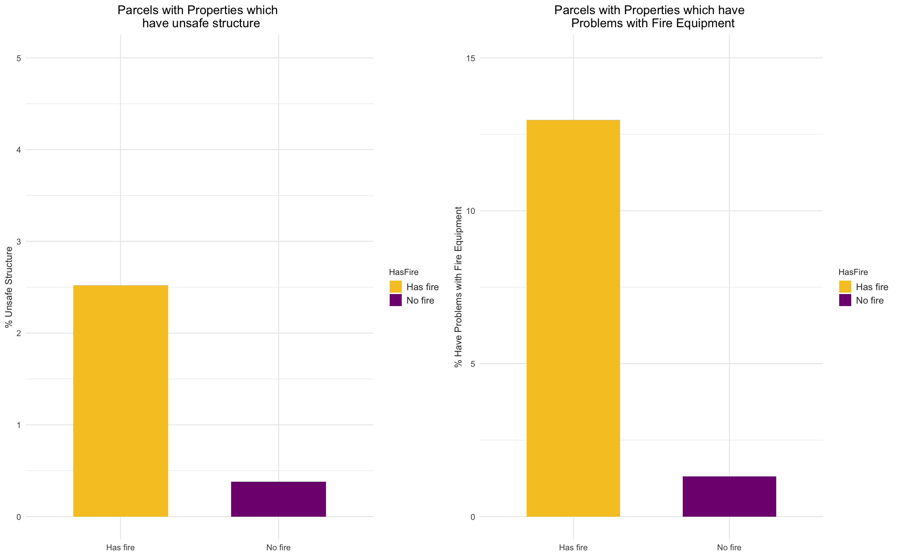

### 311 Request

We also identified that the presence of blight in surrounding environment will affect fire occurrence. Properties that are closed to broken street lights, no heat houses, infestation residential are more likely to catch on fire.

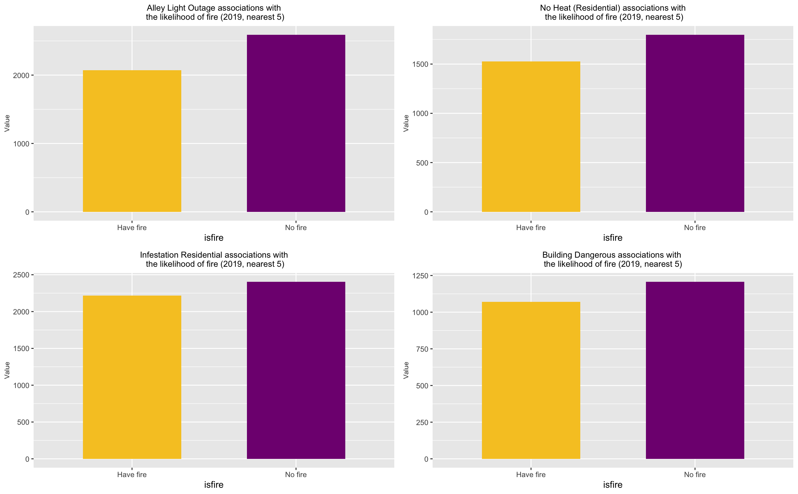


# Modeling

## Feature Selection

Having explored the relationship between various features and the past fire events, we proceeded to build our model to predict the fire risk for each property in Philadelphia. 

As we have discussed in the previous session, the final predictor variables are classified into 4 categories: fire feature, demographic feature, property feature and risk factor (below are only part of significant variables). The goal of our model is to learn from observed fire events to predict the relative fire risk for all parcels. 

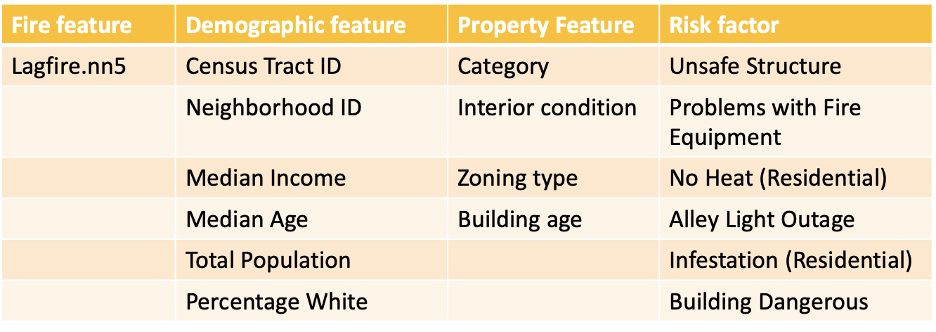

## Resampling

Among all urban spatial risks, fire is one of the most difficult to predict. There are a few reasons: fire event is highly random – it is hard to predict when the residents will accidentally drop their cigarette on a piled trash can. More importantly, Fire event is very rare. Among the 450,000+ parcels in Philadelphia, only around 15,000 have a record of fire in the past 5 years, i.e., once in every 30 properties. With such unbalanced sample, it is hard to extract the features that can distinct high-risk buildings and low-risk buildings.

Thus, we resampled the dataset until the catching-fire percentage raised to 20%, i.e., once in every 5 properties. This resampling processed helped to improve the model accuracy. However, it also distorted the probability of buildings catching fire. In other words, our model tends to predict more buildings fires than in reality.

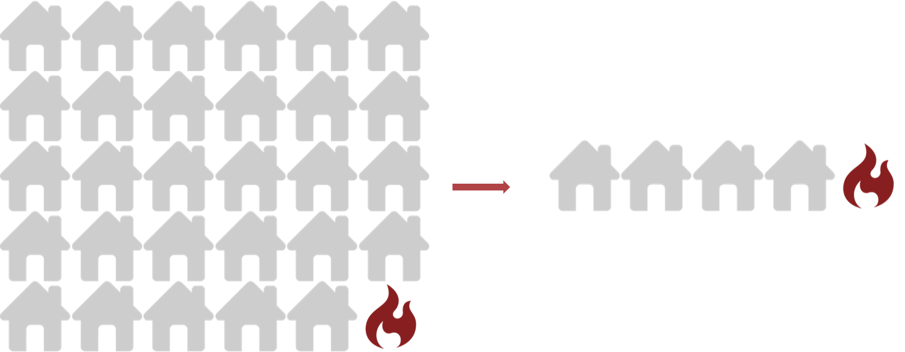

## Model Building

With our final predictor variables determined and training set resampled, we proceeded to test different algorithms to identify which would be the best in predicting property fire risk in Philadelphia. We developed a generalized linear regression model (GLM) and a random forest model (RF). As we compared the model criteria, we found that the RF model showed no significant superiority compared to the GLM model in terms of sensitivity and specificity. Thus, we decided to adopt GLM as our final model, for its relative simplicity ensured higher interpretability.

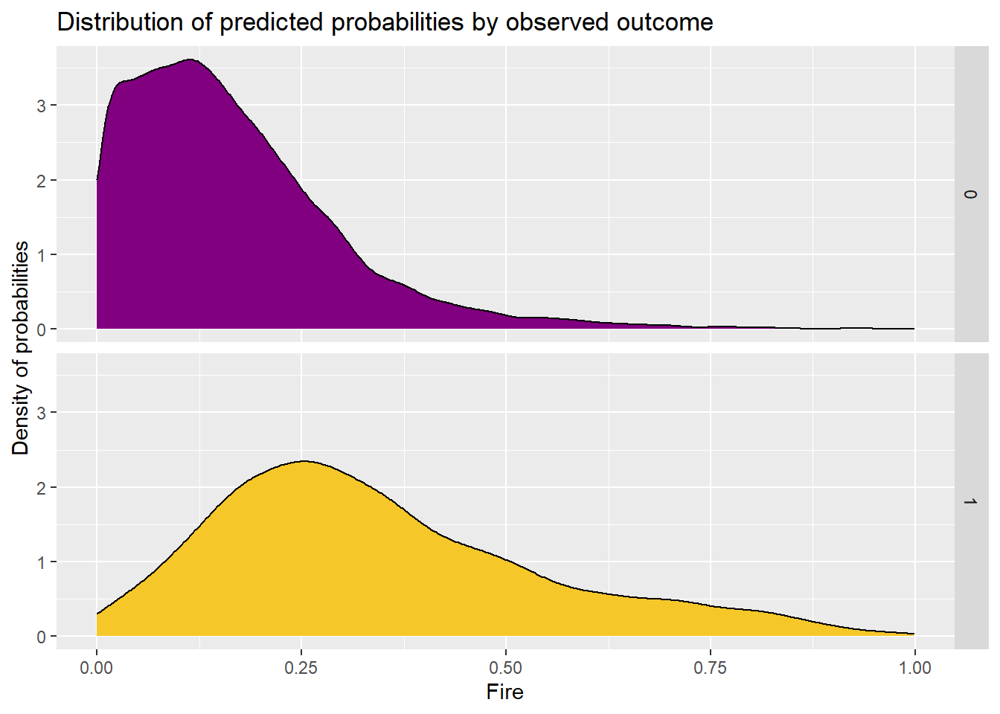

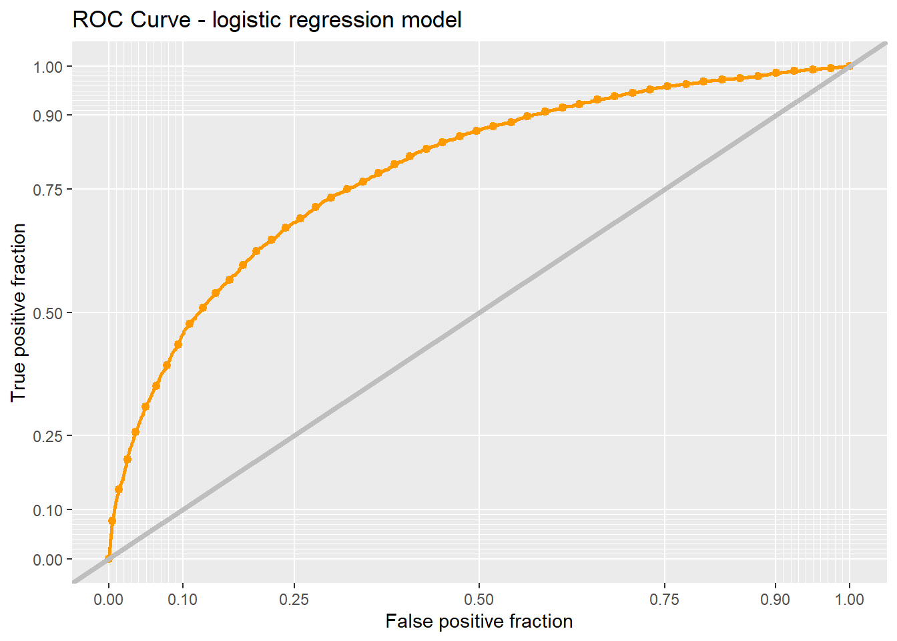

Using various metrics, we determined how well the final model predicted for unknown data by validating it on the test set. Despite the resampling process, the model is still better at predicting those parcels that don’t have fire occurrence. However, we were still able to achieve a sensitivity of 0.70 and a specificity of 0.73 using the predictor variables. In other words, we have 70% of the building fires correctly identified. In addition, the ROC curve for the final model shows no sign of overfitting.

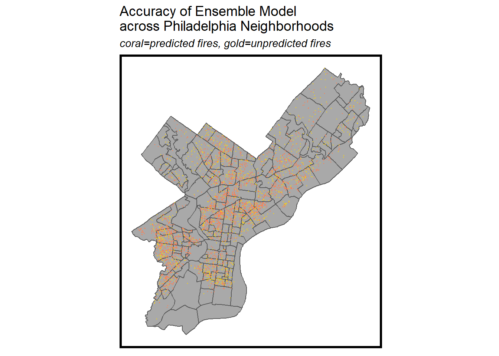

Despite the fact that fire event is very difficult to predict, our model has a fair accuracy and showed similar spatial pattern as the past fire events. The coral points showed the fires we successfully predicted, while the golden ones showed those we failed to identify using current predictors.


## Model Validation

Last but not least, we validated our model using several metrics to check if it is both accurate and generalizable under different contexts.

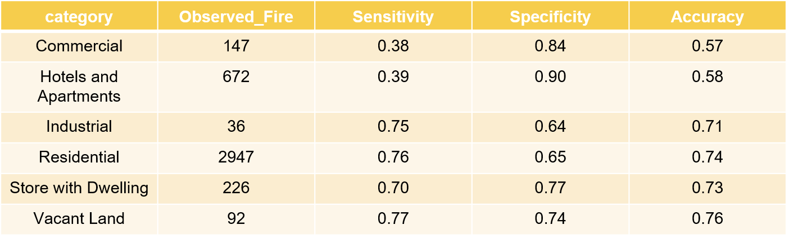

We first tested our model’s generalizability across land use types. Our model works best on residential properties. The hotel and commercial properties seem to have very different characteristics.

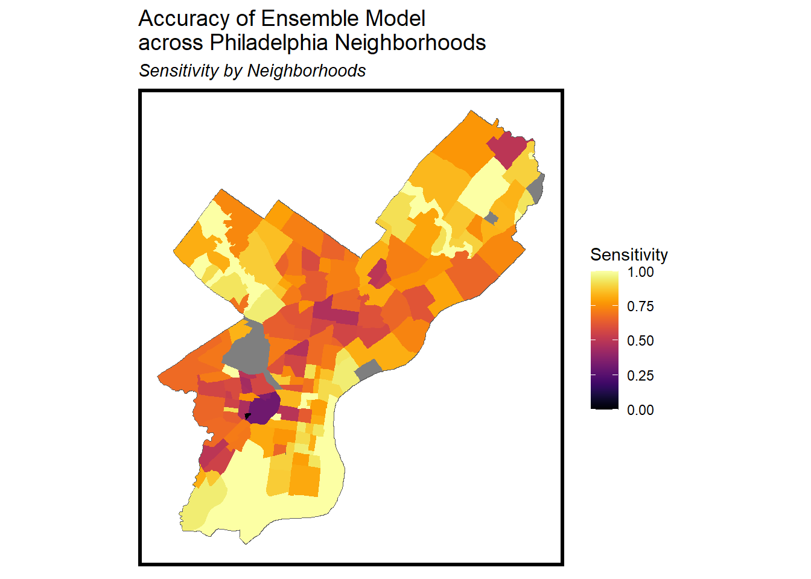

We also examined the model’s performance across Philadelphia neighborhoods. As shown on the map below, our model is not doing so well in a few West Philly neighborhoods, possibly due to the above-mentioned performance issue on certain land use types. Nevertheless, since most building fires happen in residential areas, and that residential building fire’s great cost compared to other types, our model still provides a useful reference for the fire department.

# Conclusions

Based on the final model, we have created an algorithm to assess the relative fire risk at parcel level, which is reasonably accurate yet generalizable for different land use types and neighborhoods in Philadelphia. In the future, this model can be improved by including more predictor variables. 

Finally, the algorithm outlined in this report was used to build an API as well as a web application that allows the Philadelphia Fire Department to access property information and fire risk assessment based on real-time request. Our hope is that the risk model and API application can be used by the department to improve the firefighter’s situational awareness, and that more work can be done to improve it further.

# Appendix

## Data Wrangling

```{r,results=FALSE}
library(tidyverse)
library(sf)
library(QuantPsyc)
library(RSocrata)
library(viridis)
library(caret)
library(spatstat)
library(spdep)
library(FNN)
library(grid)
library(gridExtra)
library(knitr)
library(kableExtra)
library(tidycensus)

library(mapview)
library(httr)
library(dplyr)
library(readxl)
library(stringr)
library(raster)
library(ggplot2)
library(lubridate)

qBr <- function(df, variable, rnd) {
  if (missing(rnd)) {
    as.character(quantile(round(df[[variable]],0),
                          c(.01,.2,.4,.6,.8), na.rm=T))
  } else if (rnd == FALSE | rnd == F) {
    as.character(formatC(quantile(df[[variable]]), digits = 3),
                          c(.01,.2,.4,.6,.8), na.rm=T)
  }
}

q5 <- function(variable) {as.factor(ntile(variable, 5))}
palette5 <- c("#25CB10", "#5AB60C", "#8FA108",   "#C48C04", "#FA7800")

mapTheme <- function(base_size = 12) {
  theme(
    text = element_text( color = "black"),
    plot.title = element_text(size = 14,colour = "black"),
    plot.subtitle=element_text(face="italic"),
    plot.caption=element_text(hjust=0),
    axis.ticks = element_blank(),
    panel.background = element_blank(),axis.title = element_blank(),
    axis.text = element_blank(),
    axis.title.x = element_blank(),
    axis.title.y = element_blank(),
    panel.grid.minor = element_blank(),
    panel.border = element_rect(colour = "black", fill=NA, size=2)
  )
}

plotTheme <- function(base_size = 12) {
  theme(
    text = element_text( color = "black"),
    plot.title = element_text(size = 14,colour = "black"),
    plot.subtitle = element_text(face="italic"),
    plot.caption = element_text(hjust=0),
    axis.ticks = element_blank(),
    panel.background = element_blank(),
    panel.grid.major = element_line("grey80", size = 0.1),
    panel.grid.minor = element_blank(),
    panel.border = element_rect(colour = "black", fill=NA, size=2),
    strip.background = element_rect(fill = "grey80", color = "white"),
    strip.text = element_text(size=12),
    axis.title = element_text(size=12),
    axis.text = element_text(size=10),
    plot.background = element_blank(),
    legend.background = element_blank(),
    legend.title = element_text(colour = "black", face = "italic"),
    legend.text = element_text(colour = "black", face = "italic"),
    strip.text.x = element_text(size = 14)
  )
}

# count function 
count_net <- function(data,fishnetGrid, name){
  count<- data %>% #get count by fishnet
    dplyr::select() %>% 
    mutate(count = 1) %>% 
    aggregate(., fishnetGrid, sum) %>%
    mutate(count = ifelse(is.na(count), 0, count),uniqueID = rownames(.))%>%
    plyr::rename(.,c('count' = name))
  return (count)
}

#Nearest neighbor (NND) function
nn_function <- function(measureFrom,measureTo,k) {
  measureFrom_Matrix <- as.matrix(measureFrom)
  measureTo_Matrix <- as.matrix(measureTo)
  nn <-   
    get.knnx(measureTo, measureFrom, k)$nn.dist
    output <-
      as.data.frame(nn) %>%
      rownames_to_column(var = "thisPoint") %>%
      gather(points, point_distance, V1:ncol(.)) %>%
      arrange(as.numeric(thisPoint)) %>%
      group_by(thisPoint) %>%
      summarize(pointDistance = mean(point_distance)) %>%
      arrange(as.numeric(thisPoint)) %>% 
      dplyr::select(-thisPoint) %>%
      pull()
    
  return(output)  
}

palette2 <- c("#F6C729","#800080")
palette3 <- c("#800080","#F6C729")
```

```{r,results=FALSE}
#setwd("~/Desktop/City Planning/2021 spring/801")
#fire2019 <- read_csv("./data/fire_dataset.csv")
fire2019 <- read_excel("./data/fire.xlsx")
fire2020 <- read_excel("./data/fire2020.xlsx")
fire2020 <- fire2020%>%mutate(addr_type = 1)
fire2019 <- subset(fire2019, select = -c(city,state,descript_b))
fire2020 <- subset(fire2020, select = -c(Propuse_desc,Code,Act_desc,Census,Occup_id))
fire2019 <- 
  fire2019 %>%
  mutate(date=dmy(alm_date),
         Year=year(date),
         Month=month(date))
fire2020 <- 
  fire2020 %>%
  mutate(date=as.Date(alm_date),
         Year=year(date),
         Month=month(date))
fire <- rbind(fire2019, fire2020)

#setdiff(names(fire2020),names(fire2019))
#setdiff(names(fire2019),names(fire2020))

property <- read_csv("./data/opa_properties_public.csv")
parcel <- read_csv("./data/DOR_Parcel.csv")
#opa <- read_csv("./data/Fire_OPA_Parcel.csv")
#opa <- read_csv("./data/all_opa_par_addr.csv")
opa <- read_csv("./data/fireData_opa_par_addr.csv")

#opa[opa$Freq > 1,]

violation1 <- read_csv("./data/violations.csv")
violation2 <- read_csv("./data/violations2.csv")
#violation3 <- read_csv("./data/violations2.csv")
```

```{r,results=FALSE}
#join fire with opa num
fire1 = fire %>%
  filter(addr_type ==1)
fire1$address <- paste(ifelse(is.na(fire1$number)==FALSE,fire1$number,''),
                       "%20",
                       ifelse(is.na(fire1$st_prefix)==FALSE,fire1$st_prefix,''),
                       "%20",
                       ifelse(is.na(fire1$street)==FALSE,fire1$street,''),
                       "%20",
                       ifelse(is.na(fire1$st_type)==FALSE,fire1$st_type,''), sep = "")
fire2 = fire %>%
  filter(addr_type ==2)
fire2$address <- paste(ifelse(is.na(fire2$xst_prefix)==FALSE,fire2$xst_prefix,''),
                       ifelse(fire2$xst_prefix!='',"%20",''),
                       ifelse(is.na(fire2$xstreet)==FALSE,fire2$xstreet,''),
                       "%20",
                       ifelse(is.na(fire2$xst_type)==FALSE,fire2$xst_type,''),
                       "%20",
                       "&",
                       "%20",
                       ifelse(is.na(fire2$st_prefix)==FALSE,fire2$st_prefix,''), 
                       ifelse(fire2$st_prefix!='',"%20",''),
                       ifelse(is.na(fire2$street)==FALSE,fire2$street,''), 
                       "%20",
                       ifelse(is.na(fire2$st_type)==FALSE,fire2$st_type,''),
                       sep = "")  
fireData <- rbind(fire1, fire2)
fireData$MUSA_ID <- paste0("MUSA_",1:nrow(fireData))

opa <- rename(opa, OPA_Num = opa_account_num)

#fire_opa <- left_join(fireData,opa,by='address')
fire_opa <- left_join(fireData,opa,by='MUSA_ID')

#join property data with fire data
property <- rename(property, OPA_Num = parcel_number)
property_fire <- left_join(property,fire_opa,by='OPA_Num')

parcel <- rename(parcel, registry_number = BASEREG)
parcel_pro_fire <- left_join(parcel,property_fire,by='registry_number')

parcel_pro_fire = parcel_pro_fire %>%filter(ADDR_STD==location)

sort(names(parcel_pro_fire))
```

```{r,results=FALSE}
limit <- 
  st_read("./data/City_Limits-shp/city_limits.shp") %>%
  st_transform(2272)

#ggplot() + 
#  geom_sf(data = limit)

tracts <- 
  st_read("http://data.phl.opendata.arcgis.com/datasets/ccdc0d022f4949a7b11333bd37231aef_0.geojson")%>%
  st_set_crs(4326) %>%
  na.omit() %>%
  st_transform(crs=2272)

neighborhoods <- 
  st_read("https://raw.githubusercontent.com/azavea/geo-data/master/Neighborhoods_Philadelphia/Neighborhoods_Philadelphia.geojson")%>%
  st_set_crs(4326) %>%
  na.omit() %>%
  st_transform(crs=2272)

dor <- 
  st_read("./data/DOR_Parcel/DOR_Parcel.shp")

```

```{r,results=FALSE}
# load the fire data
coords = st_centroid(dor)

parcel.sf <- 
  st_as_sf(coords, crs = 4326) %>%
  st_transform(2272)

parcel.sf <- rename(parcel.sf, registry_number = BASEREG)
parcel.sf2 <- left_join(parcel.sf,property_fire,by='registry_number')
parcel.sf2 = parcel.sf2 %>%filter(ADDR_STD==location)

#setdiff(names(parcel.sf2),names(parcel_pro_fire))
#setdiff(names(parcel_pro_fire),names(parcel.sf2))
#parcel.sf2 <- subset(parcel.sf2, select = -c(ADDR_SOURC,SEPARATED_,MUNIMENT_T,MUNIMENT_I,Shape__Are,Shape__Len))

sort(names(parcel.sf2))

#parcel.sf2[parcel.sf2$Freq > 1,]
#parcel.sf2[parcel.sf2$id %in% parcel.sf2$Var1[parcel.sf2$Freq > 1],]
parcel.sf2 <- dplyr::distinct(parcel.sf2, .keep_all = TRUE)

parcel.sf2 <- mutate(parcel.sf2, isfire = case_when(
  is.na(inci_no) == FALSE  ~ "Have fire",
  is.na(inci_no) == TRUE  ~ "No fire"))

```

##  Exploratory Analysis

### Previous Fire

```{r}
#unique(fire.sf$Year)
sort(table(parcel.sf2$Year),decreasing=TRUE)

firebyyear<-subset(parcel.sf2, !is.na(Year))

fire_year <-ggplot(firebyyear, aes(x=factor(Year))) +
  geom_bar(aes(fill=factor(Year)),stat="count") +
  scale_fill_viridis(discrete=TRUE, option='inferno')+
  labs(title = "Fire by Year", x = "Fire Year", y = "Count") +
  plotTheme()


#unique(fire.sf$descript)
sort(table(firebyyear$descript),decreasing=TRUE)

firep    <- firebyyear %>% filter(firebyyear$descript == 'Cooking fire, confined to container' |firebyyear$descript == 'Building Fire, No Collapse' |firebyyear$descript =='Building fire' |firebyyear$descript =='Outside rubbish fire, Other' |firebyyear$descript =='Outside rubbish, trash or waste fire' |firebyyear$descript =='Passenger vehicle fire' |firebyyear$descript =='Trash or rubbish fire, contained' |firebyyear$descript =='Mobile property (vehicle) fire, Other' |firebyyear$descript =='Brush or brush-and-grass mixture fire' |firebyyear$descript =='Special outside fire, Other')

firep <- within(firep, 
                descript <- factor(descript, 
                                   levels=names(sort(table(descript), 
                                                        decreasing=TRUE))))

fire_type <- ggplot(firep, aes(x=factor(descript))) +
  geom_bar(aes(fill=factor(descript)),stat="count") +
  scale_fill_viridis(discrete=TRUE, option='inferno', direction = -1)+
  labs(title = "Fire by Type", x = "Fire Type", y = "Count") +
  theme(axis.text.x=element_blank())+
  plotTheme()

grid.arrange(fire_year,fire_type, nrow = 1)
```

```{r}
fire.sf <- firebyyear

fire.sf_20 <- fire.sf[fire.sf$Year==2020,]
fire.sf_202 <- fire.sf_20[!is.na(fire.sf_20$Year),]

fire.sf_19 <- fire.sf[fire.sf$Year==2019,]
fire.sf_192 <- fire.sf_19[!is.na(fire.sf_19$Year),]

#fire.sf_192[fire.sf_192$Freq > 1,]

fire.sf_18 <- fire.sf[fire.sf$Year==2018,]
fire.sf_182 <- fire.sf_18[!is.na(fire.sf_18$Year),]

fire.sf_17 <- fire.sf[fire.sf$Year==2017,]
fire.sf_172 <- fire.sf_18[!is.na(fire.sf_17$Year),]

fire.sf_16 <- fire.sf[fire.sf$Year==2016,]
fire.sf_162 <- fire.sf_18[!is.na(fire.sf_16$Year),]

fire.sf_15 <- fire.sf[fire.sf$Year==2015,]
fire.sf_152 <- fire.sf_18[!is.na(fire.sf_15$Year),]

```

```{r}
parcel.sf2$lagfire.nn5 <-nn_function(st_coordinates(parcel.sf2),st_coordinates(fire.sf),5)

# the distance from the nearest 5 fires to the center of the grid for each year(2015-2020)
parcel.sf2$lagfire20.nn5 <-nn_function(st_coordinates(parcel.sf2),st_coordinates(fire.sf_202),5) 
parcel.sf2$lagfire19.nn5 <-nn_function(st_coordinates(parcel.sf2),st_coordinates(fire.sf_192),5) 
parcel.sf2$lagfire18.nn5 <-nn_function(st_coordinates(parcel.sf2),st_coordinates(fire.sf_182),5) 
parcel.sf2$lagfire17.nn5 <-nn_function(st_coordinates(parcel.sf2),st_coordinates(fire.sf_172),5) 
parcel.sf2$lagfire16.nn5 <-nn_function(st_coordinates(parcel.sf2),st_coordinates(fire.sf_162),5) 
parcel.sf2$lagfire15.nn5 <-nn_function(st_coordinates(parcel.sf2),st_coordinates(fire.sf_152),5)

```


```{r}
nnfire <- parcel.sf2 %>%
    ggplot(aes(isfire, lagfire.nn5, fill=isfire)) + 
      geom_bar(position = "dodge", stat = "summary", fun.y = "mean") + 
      scale_fill_manual(values = palette2) +
      labs(x="isfire", y="Value", 
           title = "Distance to nearest past fire events (nn5), 2015~2020") +
      theme(legend.position = "none")

parcel.sf2.sample <- parcel.sf2[sample(nrow(parcel.sf2), 30000), ]

density_all <- ggplot()+ 
  geom_sf(data = limit%>%st_transform(4326), fill = "grey", color = NA) +
  geom_point(data=parcel.sf2.sample, aes(x=lat,y=lng,color = lagfire.nn5), size=0.2) +
  scale_color_viridis(option='inferno', direction = -1) +
  labs(subtitle = "Distance to nearest past fire events (nn5), 2015~2020") +
  mapTheme()

grid.arrange(nnfire,density_all, nrow = 1)

```

### Neighborhood Story

```{r,results=FALSE}
census <- get_acs(geography = "tract",
                  variables=c("B01003_001", "B19013_001", 
                              "B02001_002", "B01002_001","B06009_005"),
                  key="d72b594e4d0f9b9b34217cdea8a4bcbc60354e21",
                  state=42,
                  geometry=TRUE,
                  county=101,
                  output="wide")

census1 <- census%>%
  rename(Total_Pop=B01003_001E,
         Med_Inc=B19013_001E,
         Med_Age=B01002_001E,
         White_Pop=B02001_002E,
         Bachelor_Pop=B06009_005E) %>%
  dplyr::select(Total_Pop, Med_Inc, White_Pop,Bachelor_Pop, Med_Age,geometry) %>%
  mutate(Percent_White = White_Pop / Total_Pop,Percent_Bachelor=Bachelor_Pop/ Total_Pop)%>%
  dplyr::select(- White_Pop,-Bachelor_Pop)

#write_csv(census1,'census1')

parcel.sf2 <- 
  st_join(parcel.sf2,census1%>% st_transform(2272),st_covered_by,left=TRUE) 

```

```{r}
cen1 <- ggplot() + 
  geom_sf(data = census1, aes(fill = Med_Inc)) +
  scale_fill_viridis(option='inferno') +
  labs(title = "Median Income, 2019") +
  mapTheme() 

cen2 <- ggplot() + 
  geom_sf(data = census1, aes(fill = Med_Age)) +
  scale_fill_viridis(option='inferno') +
  labs(title = "Median Age, 2019") +
  mapTheme() 

cen3 <- ggplot() + 
  geom_sf(data = census1, aes(fill = Total_Pop)) +
  scale_fill_viridis(option='inferno') +
  labs(title = "Total Population, 2019") +
  mapTheme() 

cen4 <- ggplot() + 
  geom_sf(data = census1, aes(fill = Percent_White)) +
  scale_fill_viridis(option='inferno') +
  labs(title = "Percentage White, 2019") +
  mapTheme() 

grid.arrange(cen1,cen2,cen3,cen4, nrow = 2)

```

```{r}
fire_tracts_all <- 
  fire.sf %>% 
  dplyr::select() %>% 
  mutate(count = 1) %>% 
  aggregate(., tracts, sum) %>%
  mutate(count = ifelse(is.na(count), 0, count),
         uniqueID = rownames(.),
         cvID = sample(round(nrow(tracts) / 24), size=nrow(tracts), replace = TRUE))

tract_all <- ggplot() + 
  geom_sf(data = fire_tracts_all, aes(fill = count)) +
  scale_fill_viridis(option='inferno') +
  labs(title = "Fire by Tract, 2015~2020") +
  mapTheme() 


fire_neighborhoods_all <- 
  fire.sf %>% 
  dplyr::select() %>% 
  mutate(count = 1) %>% 
  aggregate(., neighborhoods, sum) %>%
  mutate(count = ifelse(is.na(count), 0, count),
         uniqueID = rownames(.),
         cvID = sample(round(nrow(neighborhoods) / 24), size=nrow(neighborhoods), replace = TRUE))

hood20 <- ggplot() + 
  geom_sf(data = fire_neighborhoods_all, aes(fill = count)) +
  scale_fill_viridis(option='inferno') +
  labs(title = "Fire by Neighborhood, 2015~2020") +
  mapTheme() 

grid.arrange(tract_all,hood20, nrow = 1)
```

```{r}
library(ggpmisc)

fire_tracts_census <- 
  st_join(fire_tracts_all,census1%>% st_transform(2272),join = st_intersects,left=TRUE) 

correlation.long <-
  st_set_geometry(fire_tracts_census , NULL) %>%
    dplyr::select(-uniqueID, -cvID) %>%
    gather(Variable, Value, -count)

inc_graph <- ggplot(fire_tracts_census, aes(x = Med_Inc, y = count)) +
    geom_point() +
    stat_smooth(method = "lm",
         se=F, colour = "#FA7800")+
stat_poly_eq(formula = y ~ x,
               eq.with.lhs = "italic(hat(y))~`=`~",
               aes(label = paste(..rr.label.., sep =" ")), 
               parse = TRUE, label.x = 60, label.y = 70)

pop_graph <- ggplot(fire_tracts_census, aes(x = Total_Pop, y = count)) +
    geom_point() +
    stat_smooth(method = "lm",
         se=F, colour = "#FA7800")+
stat_poly_eq(formula = y ~ x,
               eq.with.lhs = "italic(hat(y))~`=`~",
               aes(label = paste(..rr.label.., sep =" ")), 
               parse = TRUE, label.x = 60, label.y = 70)

white_graph <- ggplot(fire_tracts_census, aes(x = Percent_White, y = count)) +
    geom_point() +
    stat_smooth(method = "lm",
         se=F, colour = "#FA7800")+
stat_poly_eq(formula = y ~ x,
               eq.with.lhs = "italic(hat(y))~`=`~",
               aes(label = paste(..rr.label.., sep =" ")), 
               parse = TRUE, label.x = 60, label.y = 70)

grid.arrange(inc_graph,pop_graph, nrow = 1)
```

### Building Features

```{r}
parcel.sf2_nobuilding<-parcel.sf2

parcel.sf2 <-mutate(parcel.sf2, category = case_when(
  category_code == 1  ~ "Residential",
  category_code == 2  ~ "Hotels and Apartments",
  category_code == 3  ~ "Store with Dwelling",
  category_code == 4  ~ "Commercial",
  category_code == 5  ~ "Industrial",
  category_code == 6  ~ "Vacant Land"))

parcel.sf2 <-mutate(parcel.sf2, interior = case_when(
  interior_condition == 0  ~ "Not Applicable",
  interior_condition == 2  ~ "New/Rehabbed",
  interior_condition == 3  ~ "Above Average",
  interior_condition == 4  ~ "Average",
  interior_condition == 5  ~ "Below Average",
  interior_condition == 6  ~ "Vacant",
  interior_condition == 7  ~ "Sealed / Structurally Compromised"))

parcel.sf2$year_built <- as.numeric(as.character(parcel.sf2$year_built))
parcel.sf2 <-mutate(parcel.sf2, year_built_cat = case_when(
  year_built >= 1600 & year_built < 1800 ~ "1600-1800",
  year_built >= 1800 & year_built < 1900 ~ "1800s",
  year_built >= 1900 & year_built < 2000  ~ "1900s",
  year_built >= 2000 & year_built < 2010  ~ "2000-2010",
  year_built >= 2010 & year_built < 2020  ~ "2010-2020",
  year_built < 1000 | year_built >2020 ~ "Unknown"))

```

```{r}
###EDA plot
library(gridExtra)
correlations <- read_csv("./data/statistics2.csv")

histcom<-ggplot(correlations, aes(x = HasFire, y = Commercial,fill= HasFire)) + 
  geom_bar(stat='identity', width =0.6) +
  scale_fill_manual(values = palette2) +
  theme_minimal() +
  ylim(0,10) +
  labs(y = "% Commercial", 
       title = 'Parcels with Commercial Properties') +
  theme(axis.title.x=element_blank()) +
  theme(plot.title = element_text(hjust = 0.5, size = 11))+
  theme(axis.title.y = element_text(color = "grey20", size = 8))+
  theme(legend.key.size = unit(0.5, 'cm'),legend.title = element_text(color = "grey20",size=9),legend.text = element_text(color = "grey20",size=8))
#histcom

histhot<-ggplot(correlations, aes(x = HasFire, y = Hotels_Apartments, fill= HasFire)) + 
  geom_bar(stat='identity', width =0.6) +
  scale_fill_manual(values = palette2) +
  theme_minimal() +
  ylim(0,30) +
  labs(y = "% Hotels & Apartments", 
       title = 'Parcels with Hotels & Apartments') +
  theme(axis.title.x=element_blank()) +
  theme(plot.title = element_text(hjust = 0.5, size = 11))+
  theme(axis.title.y = element_text(color = "grey20", size = 8))+
  theme(legend.key.size = unit(0.5, 'cm'),legend.title = element_text(color = "grey20",size=9),legend.text = element_text(color = "grey20",size=8))
#histhot

histrm1<-ggplot(correlations, aes(x = HasFire, y = rm1, fill= HasFire)) + 
  geom_bar(stat='identity', width =0.6) +
  scale_fill_manual(values = palette2) +
  theme_minimal() +
  ylim(0,25) +
  labs(y = "% RM1 Zoning Type", 
       title = 'Parcels with RM1 Zoning Type') +
  theme(axis.title.x=element_blank()) +
  theme(plot.title = element_text(hjust = 0.5, size = 11))+
  theme(axis.title.y = element_text(color = "grey20", size = 8))+
  theme(legend.key.size = unit(0.5, 'cm'),legend.title = element_text(color = "grey20",size=9),legend.text = element_text(color = "grey20",size=8))
#histrm1

histcmx2<-ggplot(correlations, aes(x = HasFire, y = cmx2, fill= HasFire)) + 
  geom_bar(stat='identity', width =0.6) +
  scale_fill_manual(values = palette2) +
  theme_minimal() +
  ylim(0,10) +
  labs(y = "% CMX2 Zoning Type", 
       title = 'Parcels with CMX2 Zoning Type') +
  theme(axis.title.x=element_blank()) +
  theme(plot.title = element_text(hjust = 0.5, size = 11))+
  theme(axis.title.y = element_text(color = "grey20", size = 8))+
  theme(legend.key.size = unit(0.5, 'cm'),legend.title = element_text(color = "grey20",size=9),legend.text = element_text(color = "grey20",size=8))
#histcmx2

histsea<-ggplot(correlations, aes(x = HasFire, y = sealed, fill= HasFire)) + 
  geom_bar(stat='identity', width =0.6) +
  scale_fill_manual(values = palette2) +
  theme_minimal() +
  ylim(0,5) +
  labs(y = "% Structurally Compromised", 
       title = 'Parcels with Structurally Compromised Properties') +
  theme(axis.title.x=element_blank()) +
  theme(plot.title = element_text(hjust = 0, size = 11))+
  theme(axis.title.y = element_text(color = "grey20", size = 8))+
  theme(legend.key.size = unit(0.5, 'cm'),legend.title = element_text(color = "grey20",size=9),legend.text = element_text(color = "grey20",size=8))
#histsea

histbel<-ggplot(correlations, aes(x = HasFire, y = `below average`, fill= HasFire)) + 
  geom_bar(stat='identity', width =0.6) +
  scale_fill_manual(values = palette2) +
  theme_minimal() +
  ylim(0,5) +
  labs(y = "% Below Average", 
       title = 'Parcels with Properties which are below average') +
  theme(axis.title.x=element_blank()) +
  theme(plot.title = element_text(hjust = 0, size = 11))+
  theme(axis.title.y = element_text(color = "grey20", size = 8))+
  theme(legend.key.size = unit(0.5, 'cm'),legend.title = element_text(color = "grey20",size=9),legend.text = element_text(color = "grey20",size=8))
#histbel

grid.arrange(histcom, histhot, histrm1, histcmx2, histsea, histbel, nrow = 3)
```

### Code violation

```{r}
parcel.sf2_noviolation <- parcel.sf2

violation_all <- rbind(violation1,violation2)
violation_all$year <- year(violation_all$violationdate)
#violation_new = violation_all %>%filter(year <= 2020) %>%filter(is.na(opa_account_num)==FALSE)
violation = violation_all %>%filter(year <= 2020) %>%filter(is.na(opa_account_num)==FALSE)

violation <-mutate(violation, violation_summary = case_when(
  str_detect(violationcodetitle, "UNSAFE STRUCTURE") == TRUE | str_detect(violationcodetitle, "UNSAFE CONDITIONS") == TRUE | str_detect(violationcodetitle, "INTERIOR UNSAFE") == TRUE | str_detect(violationcodetitle, "VACANT PROP UNSAFE") == TRUE ~ "UNSAFE STRUCTURE",
  str_detect(violationcode, "FC-13") == TRUE | str_detect(violationcode, "FC-907.3") == TRUE | 
    violationcodetitle == "ELECTRICAL -FIRE DAMAGED"~ "PROBLEMS WITH FIRE EQUIPTEMENT",
  TRUE ~ "OTHERS"))

###count of Previous Violations
violation_count<-violation%>% 
  group_by(opa_account_num)%>%
  summarize(viol_count=n())

violation_count_related<-violation %>%
  filter(violation_summary == 'UNSAFE STRUCTURE'|violation_summary =='PROBLEMS WITH FIRE EQUIPTEMENT')%>%
  group_by(opa_account_num) %>%
  summarize(related_violation=n())

violations_clean <- left_join(violation,violation_count, by='opa_account_num')
violations_clean <- left_join(violations_clean,violation_count_related, by='opa_account_num')
violations_clean$related_violation<-ifelse(!is.na(violations_clean$related_violation),
                                          violations_clean$related_violation, 0)

##had vilation before?
violations_clean$had_relatedviolation<-ifelse(violations_clean$related_violation >0, 1,0)

##owner count
owner_count<-violations_clean%>% 
  group_by(opa_owner)%>%
  summarize(owner_count=n())
owner_count <- owner_count[-c(1), ]

violations_clean <- left_join(violations_clean,owner_count, by='opa_owner')
violations_clean$owner_count<-ifelse(is.na(violations_clean$owner_count),1,violations_clean$owner_count)

#type
violations_clean$exterior<-ifelse(grepl("EXT", violations_clean$violationcodetitle), 1,0)
violations_clean$interior<-ifelse(grepl("INT", violations_clean$violationcodetitle), 1,0)

#time length in days
violations_clean2<-violations_clean
violations_clean2$now<-as.Date('2021-01-01')
violations_clean2$violationsdate2<-as.Date(substring(violations_clean$violationdate,1,10))

violations_clean3 <-
  violations_clean2 %>%
  mutate(now2 = ymd(now),
         then2 = ymd(violationsdate2))

violations_clean3$duration_sincelast_vio <- violations_clean3$now2-violations_clean3$then2

violations_clean3$duration_sincelast_vio_num <- as.numeric(as.character(violations_clean3$duration_sincelast_vio))

#num of ext/int
violations_summed <-
  violations_clean3 %>%
  group_by(opa_account_num) %>%
  summarise(had_extvio = sum(exterior),
            had_intvio = sum(interior))
violations_clean4<-left_join(violations_clean3,violations_summed, by='opa_account_num')

##violation status##
#table(violations_clean4$violationstatus)
#table(violations_clean4$casestatus)
violations_clean4$issue_fixed<-ifelse(violations_clean4$violationstatus=="COMPLIED",1, ifelse(violations_clean4$violationstatus=="RESOLVE", 1,0))
violations_clean4$active_case<-ifelse(violations_clean4$casestatus=="CLOSED", 0, 1)

#remove unecessary columns
#sort(names(violations_clean4))
colSums(is.na(violations_clean4))

#violations_clean4$mostrecentinsp2<-as.Date(violations_clean4$mostrecentinsp)

vio_clean_full<-subset(violations_clean4, 
                       select=-c(objectid,addressobjectid,parcel_id_num, casenumber,
                                 casecreateddate, casecompleteddate,casetype,
                                 caseresponsibility, violationnumber,violationcode,
                                 violationresolutiondate,violationresolutioncode,
                                 unit_type, unit_num,zip,censustract,
                                 systemofrecord,geocode_x,geocode_y,caseprioritydesc,
                                  lat,lng,now, now2,then2,violationsdate2))

colSums(is.na(vio_clean_full))

violations_clean_unique <-
  vio_clean_full %>%
  group_by(opa_account_num) %>% 
  slice(which.max(mostrecentinvestigation))

X<-vio_clean_full %>%
  filter(is.na(issue_fixed)==TRUE)

unlist(lapply(violations_clean_unique,class))

violations_clean_unique$exterior<-as.factor(violations_clean_unique$exterior)
violations_clean_unique$interior <-as.factor(violations_clean_unique$interior)

violations_clean_unique <- rename(violations_clean_unique, OPA_Num = opa_account_num)

violations_clean_unique2<-subset(violations_clean_unique, 
                       select=c(viol_count,related_violation, exterior,interior,
                                duration_sincelast_vio_num,had_extvio,had_intvio,
                                issue_fixed,active_case,OPA_Num))

parcel.sf2 <- left_join(parcel.sf2,violations_clean_unique2,by='OPA_Num')
##############
#drop duplication
violation_distinct <- violation_all %>% 
  distinct(opa_account_num,violationcodetitle, .keep_all = TRUE)

#check duplication
#violation_group<- violation_distinct %>%group_by(opa_account_num)
#violation_cnt<- summarise(violation_group,count = n())

##violation status##
#table(violation_distinct$violationstatus)
#table(violation_distinct$casestatus)

violation_distinct <-mutate(violation_distinct, violation_summary = case_when(
  str_detect(violationcodetitle, "UNSAFE STRUCTURE") == TRUE | str_detect(violationcodetitle, "UNSAFE CONDITIONS") == TRUE | str_detect(violationcodetitle, "INTERIOR UNSAFE") == TRUE | str_detect(violationcodetitle, "VACANT PROP UNSAFE") == TRUE ~ "UNSAFE STRUCTURE",
  str_detect(violationcode, "FC-13") == TRUE | str_detect(violationcode, "FC-907.3") == TRUE | 
    violationcodetitle == "ELECTRICAL -FIRE DAMAGED"~ "PROBLEMS WITH FIRE EQUIPTEMENT",
  TRUE ~ "OTHERS"))
violation_distinct <- rename(violation_distinct, OPA_Num = opa_account_num)

violation_unsafe = violation_distinct %>%filter(violation_summary=="UNSAFE STRUCTURE")
violation_equip = violation_distinct %>%filter(violation_summary=="PROBLEMS WITH FIRE EQUIPTEMENT")

#drop duplication again
violation_unsafe <- violation_unsafe %>% 
  distinct(OPA_Num,violation_summary, .keep_all = TRUE)
violation_equip <- violation_unsafe %>% 
  distinct(OPA_Num,violation_summary, .keep_all = TRUE)

violation_unsafe_sub <- subset(violation_unsafe,select=c(violation_summary,OPA_Num))
violation_unsafe_sub  <- rename(violation_unsafe_sub, vio_unsafe = violation_summary)
violation_equip_sub <- subset(violation_equip,select=c(violation_summary,OPA_Num))
violation_equip_sub <- rename(violation_equip_sub, vio_equip = violation_summary)

parcel.sf2 <- left_join(parcel.sf2,violation_unsafe_sub,by='OPA_Num')
parcel.sf2 <- left_join(parcel.sf2,violation_equip_sub,by='OPA_Num')

parcel.sf2 <-mutate(parcel.sf2, isunsafe = case_when(
  is.na(vio_unsafe) == FALSE  ~ "Is unsafe",
  is.na(vio_unsafe) == TRUE  ~ "Is safe"))

parcel.sf2 <-mutate(parcel.sf2, equip_pro = case_when(
  is.na(vio_equip) == FALSE  ~ "has problem",
  is.na(vio_equip) == TRUE  ~ "no problem"))

violation_all_trim = violation_all %>%
  filter(is.na(lng) == FALSE & is.na(lat) == FALSE)

violation.sf <- violation_all_trim %>% 
  st_as_sf(coords = c("lng", "lat"), crs = 4326) %>%
  st_transform(2272)

parcel.sf2$violation.nn5 <-nn_function(st_coordinates(parcel.sf2),st_coordinates(violation.sf),5) 
```

```{r}
#violation plot
histuns<-ggplot(correlations, aes(x = HasFire, y = `unsafe structure`, fill= HasFire)) + 
  geom_bar(stat='identity', width =0.6) +
  scale_fill_manual(values = palette2) +
  theme_minimal() +
  ylim(0,5) +
  labs(y = "% Unsafe Structure", 
       title = 'Parcels with Properties which \n have unsafe structure') +
  theme(axis.title.x=element_blank()) +
  theme(plot.title = element_text(hjust = 0.5, size = 13))+
  theme(axis.title.y = element_text(color = "grey20", size = 10))+
  theme(legend.key.size = unit(0.5, 'cm'),legend.title = element_text(color = "grey20",size=9),legend.text = element_text(color = "grey20",size=10))
#histuns

histequ<-ggplot(correlations, aes(x =HasFire, y = `fire equriment`, fill= HasFire)) + 
  geom_bar(stat='identity', width =0.6) +
  scale_fill_manual(values = palette2) +
  theme_minimal() +
  ylim(0,15) +
  labs(y = "% Have Problems with Fire Equipment", 
       title = 'Parcels with Properties which have \n Problems with Fire Equipment') +
  theme(axis.title.x=element_blank()) +
  theme(plot.title = element_text(hjust = 0.5, size = 13))+
  theme(axis.title.y = element_text(color = "grey20", size = 10))+
  theme(legend.key.size = unit(0.5, 'cm'),legend.title = element_text(color = "grey20",size=9),legend.text = element_text(color = "grey20",size=10))
#histequ
grid.arrange(histuns,histequ, nrow = 1)
```

### 311 Request

```{r,results=FALSE}
request <- read_csv("./data/public_cases_fc2019.csv") %>%
  drop_na(lat)

request.sf    <- request %>% 
  st_as_sf(coords = c("lon", "lat"), crs = 4326) %>%
  st_transform(2272)
```

```{r}
parcel.sf2$request19.nn5 <-nn_function(st_coordinates(parcel.sf2),st_coordinates(request.sf),5) 
request.sf2 <- request.sf %>% filter(request.sf$service_name == 'Alley Light Outage') 
parcel.sf2$light.nn5 <-nn_function(st_coordinates(parcel.sf2),st_coordinates(request.sf2),5)
request.sf3 <- request.sf %>% filter(request.sf$service_name == 'No Heat (Residential)' ) 
parcel.sf2$heat.nn5 <-nn_function(st_coordinates(parcel.sf2),st_coordinates(request.sf3),5)
request.sf4 <- request.sf %>% filter(request.sf$service_name == 'Fire Residential or Commercial') 
parcel.sf2$fire311.nn5 <-nn_function(st_coordinates(parcel.sf2),st_coordinates(request.sf4),5)
request.sf5 <- request.sf %>% filter(request.sf$service_name == 'Infestation Residential' ) 
parcel.sf2$infestation.nn5 <-nn_function(st_coordinates(parcel.sf2),st_coordinates(request.sf5),5)
request.sf6 <- request.sf %>% filter(request.sf$service_name == 'Smoke Detector' ) 
parcel.sf2$Detector.nn5 <-nn_function(st_coordinates(parcel.sf2),st_coordinates(request.sf6),5)
request.sf7    <- request.sf %>% filter(request.sf$service_name == 'Building Dangerous' ) 
parcel.sf2$Dangerous.nn5 <-nn_function(st_coordinates(parcel.sf2),st_coordinates(request.sf7),5)

```

```{r}
## summary all 311
request19 <- parcel.sf2 %>%
    ggplot(aes(isfire, request19.nn5, fill=isfire)) + 
      geom_bar(position = "dodge", stat = "summary", fun.y = "mean", width =0.6) + 
      scale_fill_manual(values = palette2) +
     # ylim(0,90)+
      labs(x="isfire", y="Value", 
           title = "311 Request associations with the\n likelihood of fire (2019, nearest 5)") +
      theme(legend.position = "none") +
      theme(plot.title = element_text(hjust = 0.5, size = 10))+
      theme(axis.title.y = element_text(color = "grey20", size = 8))
#request19

light <- parcel.sf2 %>%
    ggplot(aes(isfire, light.nn5, fill=isfire)) + 
      geom_bar(position = "dodge", stat = "summary", fun.y = "mean", width =0.6) + 
      scale_fill_manual(values = palette2) +
      labs(x="isfire", y="Value", 
           title = "Alley Light Outage associations with\n the likelihood of fire (2019, nearest 5)") +
      theme(legend.position = "none")+
      theme(plot.title = element_text(hjust = 0.5, size = 10))+
      theme(axis.title.y = element_text(color = "grey20", size = 8))

heat <- parcel.sf2 %>%
    ggplot(aes(isfire, heat.nn5, fill=isfire)) + 
      geom_bar(position = "dodge", stat = "summary", fun.y = "mean", width =0.6) + 
      scale_fill_manual(values = palette2) +
      labs(x="isfire", y="Value", 
           title = "No Heat (Residential) associations with\n the likelihood of fire (2019, nearest 5)") +
      theme(legend.position = "none")+
      theme(plot.title = element_text(hjust = 0.5, size = 10))+
      theme(axis.title.y = element_text(color = "grey20", size = 8))

fire311 <- parcel.sf2 %>%
    ggplot(aes(isfire, fire311.nn5, fill=isfire)) + 
      geom_bar(position = "dodge", stat = "summary", fun.y = "mean", width =0.6) + 
      scale_fill_manual(values = palette2) +
      labs(x="isfire", y="Value", 
           title = "Fire Residential or Commercial associations with\n the likelihood of fire (2019, nearest 5)") +
      theme(legend.position = "none")+
      theme(plot.title = element_text(hjust = 0.5, size = 10))+
      theme(axis.title.y = element_text(color = "grey20", size = 8))

infestation <- parcel.sf2 %>%
    ggplot(aes(isfire, infestation.nn5, fill=isfire)) + 
      geom_bar(position = "dodge", stat = "summary", fun.y = "mean", width =0.6) + 
      scale_fill_manual(values = palette2) +
      labs(x="isfire", y="Value", 
           title = "Infestation Residential associations with\n the likelihood of fire (2019, nearest 5)") +
      theme(legend.position = "none")+
      theme(plot.title = element_text(hjust = 0.5, size = 10))+
      theme(axis.title.y = element_text(color = "grey20", size = 8))

Detector <- parcel.sf2 %>%
    ggplot(aes(isfire, Detector.nn5, fill=isfire)) + 
      geom_bar(position = "dodge", stat = "summary", fun.y = "mean", width =0.6) + 
      scale_fill_manual(values = palette2) +
      labs(x="isfire", y="Value", 
           title = "Smoke Detector associations with\n the likelihood of fire (2019, nearest 5)") +
      theme(legend.position = "none")+
      theme(plot.title = element_text(hjust = 0.5, size = 10))+
      theme(axis.title.y = element_text(color = "grey20", size = 8))

Dangerous <- parcel.sf2 %>%
    ggplot(aes(isfire, Dangerous.nn5, fill=isfire)) + 
      geom_bar(position = "dodge", stat = "summary", fun.y = "mean", width =0.6) + 
      scale_fill_manual(values = palette2) +
      labs(x="isfire", y="Value", 
           title = "Building Dangerous associations with \nthe likelihood of fire (2019, nearest 5)") +
      theme(legend.position = "none")+
      theme(plot.title = element_text(hjust = 0.5, size = 10))+
      theme(axis.title.y = element_text(color = "grey20", size = 8))

grid.arrange(light,heat,infestation,Dangerous, nrow = 2)

```

## Modeling

### Model Building

*Logestic regression model

```{r}
library(plotROC)
library(pROC)
library(pscl)

model_data <- parcel.sf2 

#colSums(is.na(parcel.sf2))
model_data <- subset(model_data, select = c(lagfire.nn5,lagfire20.nn5, lagfire19.nn5, lagfire18.nn5,
                                             lagfire17.nn5, lagfire16.nn5, lagfire15.nn5,
                                             category, interior.x,vio_unsafe, vio_equip,
                                             request19.nn5, light.nn5, heat.nn5, 
                                             fire311.nn5, infestation.nn5, Detector.nn5,                                             Dangerous.nn5,isfire,zoning,census_tract,Total_Pop,
                                            Med_Inc,Med_Age,Percent_White
                                            ,descript,viol_count,related_violation, exterior,
                                            interior.y, duration_sincelast_vio_num,had_extvio,
                                had_intvio,issue_fixed,active_case,violation.nn5))
colSums(is.na(model_data))

model_data$fire <- ifelse(model_data$isfire=='Have fire',1,0)
table(model_data$fire)

model_data$isunsafe<-ifelse(is.na(model_data$vio_unsafe),0,1)
model_data$noequip<-ifelse(is.na(model_data$vio_equip),0,1)
model_data$iscom<-ifelse(model_data$category=='Commercial',1,0)
model_data$ishotel<-ifelse(model_data$category=='Hotels and Apartments',1,0)
model_data$isRM1<-ifelse(is.na(model_data$zoning)|model_data$zoning!='RM1',0,1)
model_data$isCMX2<-ifelse(is.na(model_data$zoning)|model_data$zoning!='CMX2',0,1)
model_data$issealed<-ifelse(is.na(model_data$interior.x)|model_data$interior.x!='Sealed / Structurally Compromised',0,1)
model_data$isbelow<-ifelse(is.na(model_data$interior.x)|model_data$interior.x!='Below Average',0,1)

model_data$Med_Inc <-ifelse(is.na(model_data$Med_Inc),0,model_data$Med_Inc)
model_data$Med_Age<-ifelse(is.na(model_data$Med_Age),0,model_data$Med_Age)
model_data$Percent_White<-ifelse(is.na(model_data$Percent_White),0,model_data$Percent_White)

#violation
model_data$viol_count<-ifelse(is.na(model_data$viol_count),0,model_data$viol_count)
model_data$related_violation<-ifelse(is.na(model_data$related_violation),0,model_data$related_violation)
model_data$exterior<-ifelse(is.na(model_data$exterior),0,model_data$exterior)
model_data$interior.y<-ifelse(is.na(model_data$interior.y),0,model_data$interior.y)
model_data$duration_sincelast_vio_num<-ifelse(is.na(model_data$duration_sincelast_vio_num),0,model_data$duration_sincelast_vio_num)
model_data$had_extvio <-ifelse(is.na(model_data$had_extvio),0,model_data$had_extvio)
model_data$had_intvio<-ifelse(is.na(model_data$had_intvio),0,model_data$had_intvio)
model_data$issue_fixed<-ifelse(is.na(model_data$issue_fixed),0,model_data$issue_fixed)
model_data$active_case<-ifelse(is.na(model_data$active_case),0,model_data$active_case)

####Down sampling
model_data_havefire = model_data %>%
  filter(fire ==1)

"model_data_havefire = model_data_havefire%>%
  filter(model_data_havefire$descript == 'Building Fire, No Collapse' |model_data_havefire$descript =='Building fire' )"
model_data_havefire<- subset(model_data_havefire, select = c(-descript))
#table(model_data_havefire$fire)

model_data_nofire= model_data %>% filter(fire == 0)
#table(model_data_nofire$fire)

#select 108920 random rows from temp 0 (27230 *4=108920)
random_nofire <- model_data_nofire[sample(nrow(model_data_nofire), nrow(model_data_havefire)*4), ]
random_nofire<- subset(random_nofire, select = c(-descript))

#rbind 8900 rows of 0 to the 2225 rows of 1
model_data_new <- rbind(model_data_havefire,random_nofire)

#shuffle rows - generate a random ordering
set.seed(2021) ## make reproducible here, but not if generating many random samples
rand <- sample(nrow(model_data_new))
model_data_new<-model_data_new[rand,]

model_data_new2<-model_data_new %>% st_set_geometry(NULL)
  
####Modeling
set.seed(3456)
trainIndex <- createDataPartition(model_data_new2$fire, p = .75,
                                  list = FALSE,
                                  times = 1)
Train <- model_data_new2[ trainIndex,]
Test  <- model_data_new2[-trainIndex,]

# for generalizability
Test2  <- model_data_new[-trainIndex,]

#logistic regression
log_reg <- glm(fire ~ ., data=Train %>% 
                 dplyr::select(-category, -interior.x, -vio_unsafe,
                               -vio_equip,-zoning,-isfire,-census_tract,
                               -lagfire20.nn5, -lagfire19.nn5, -lagfire18.nn5,
                                             -lagfire17.nn5, -lagfire16.nn5, -lagfire15.nn5),
                  family="binomial" (link="logit"))

summary(log_reg)
pR2(log_reg)

```

```{r}
firelist <- parcel.sf2 %>% 
                 dplyr::select(lagfire.nn5, OPA_Num)
```

```{r}
testProbs <- data.frame(Outcome = as.factor(Test$fire),
                        Probs = predict(log_reg, Test, type= "response"))
#median(testProbs$Probs)
# median: 0.1626066
```

```{r}
ggplot(testProbs, aes(x = Probs, fill = as.factor(Outcome))) + 
  geom_density() +
  facet_grid(Outcome ~ .) +
  scale_fill_manual(values = palette3) +
  labs(x = "Fire", y = "Density of probabilities",
       title = "Distribution of predicted probabilities by observed outcome") +
  theme(strip.text.x = element_text(size = 18),
        legend.position = "none")
```

```{r}
testProbs <- 
  testProbs %>%
  mutate(predOutcome  = as.factor(ifelse(testProbs$Probs > 0.22 , 1, 0)))

# testProbs
```

```{r}
#(1)Accuracy: the rate of true positives plus true negatives divided by the total number of observations.
#(2)Sensitivity(true positive rate): the proportion of actual positives (1’s) that were predicted to be positive
#(3)Specificity(true negative rate): the proportion of actual negatives (0’s) that were predicted to be negatives
caret::confusionMatrix(testProbs$predOutcome, testProbs$Outcome, 
                       positive = "1")
```

```{r}
ggplot(testProbs, aes(d = as.numeric(testProbs$Outcome), m = Probs)) +
  geom_roc(n.cuts = 50, labels = FALSE, colour = "#FE9900") +
  style_roc(theme = theme_grey) +
  geom_abline(slope = 1, intercept = 0, size = 1.5, color = 'grey') +
  labs(title = "ROC Curve - logistic regression model")

ctrl <- trainControl(method = "cv", number = 100, classProbs=TRUE, summaryFunction=twoClassSummary)

```

```{r}
Test2$test_ID <- paste0("test_",1:nrow(Test2))
testProbs$test_ID <- paste0("test_",1:nrow(testProbs))

ensembleData <- left_join(Test2,testProbs, 
                                   by = "test_ID") 

ensembleData.point<-st_join(ensembleData, neighborhoods, join=st_within)

```

```{r}
ensembleData.point0<-ensembleData.point%>%
  filter(Outcome == 0)
ensembleData.point1<-ensembleData.point%>%
  filter(Outcome == 1)
ensembleData.point0p<-ensembleData.point%>%
  filter(predOutcome == 0)
ensembleData.point1p<-ensembleData.point%>%
  filter(predOutcome == 1)
```

```{r}
ensembleData.point.tp<-ensembleData.point%>%
  filter(Outcome == 1 & predOutcome == 1)
ensembleData.point.tn<-ensembleData.point%>%
  filter(Outcome == 0 & predOutcome == 0)
ensembleData.point.fp<-ensembleData.point%>%
  filter(predOutcome == 1 & Outcome == 0)
ensembleData.point.fn<-ensembleData.point%>%
  filter(predOutcome == 0 & Outcome == 1)
```

```{r}
ensembleData.point.above<-ensembleData.point%>%
  filter(Probs > 0.1626066)
ensembleData.point.below<-ensembleData.point%>%
  filter(Probs <= 0.1626066)
```

```{r}
ggplot() +
  geom_sf(data = neighborhoods, fill = "darkgrey") +
  geom_sf(data = ensembleData.point.tp, 
          #aes(fill=Outcome), 
          colour = 'coral',size=0.02) +
  #geom_sf(data = ensembleData.point.fp, 
          #aes(fill=Outcome), 
  #        colour = 'gold',size=0.02) +
  #geom_sf(data = ensembleData.point.tn, 
          #aes(fill=Outcome), 
  #        colour = 'gold',size=0.02) +
  geom_sf(data = ensembleData.point.fn, 
          #aes(fill=Outcome), 
          colour = 'gold',size=0.02) +
  labs(title= "Accuracy of Ensemble Model \nacross Philadelphia Neighborhoods",
       subtitle = "coral=predicted fires, gold=unpredicted fires") +
  #scale_fill_viridis(discrete = TRUE, direction = 1, option = "inferno",name="Sensitivity") +
  mapTheme()
```

### Model Validation

```{r}
ctrl <- trainControl(method = "cv", number = 10, classProbs=TRUE, summaryFunction=twoClassSummary)
cvFit <- train(make.names(fire) ~ ., data=Train %>% 
                 dplyr::select(-category, -interior.x, -vio_unsafe,
                               -vio_equip,-zoning,-isfire,-census_tract,
                               -lagfire20.nn5, -lagfire19.nn5, -lagfire18.nn5,
                                             -lagfire17.nn5, -lagfire16.nn5, -lagfire15.nn5),
                 #dplyr::select(-category, -interior.x, -vio_unsafe,
                #               -vio_equip,-zoning,-isfire,-census_tract,
                  #             -lagfire20.nn5, -lagfire19.nn5, -lagfire18.nn5,
                   #                          -lagfire17.nn5, -lagfire16.nn5, -lagfire15.nn5), 
                method="glm", family="binomial",
                metric="ROC", trControl = ctrl)

cvFit
```

```{r}
dplyr::select(cvFit$resample, -Resample) %>%
  gather(metric, value) %>%
  left_join(gather(cvFit$results[2:4], metric, mean)) %>%
  ggplot(aes(value)) + 
    geom_histogram(bins=35, fill = "#FF006A") +
    facet_wrap(~metric) +
    geom_vline(aes(xintercept = mean), colour = "#981FAC", linetype = 3, size = 1.5) +
    scale_x_continuous(limits = c(0, 1)) +
    labs(x="Goodness of Fit", y="Count", title="CV Goodness of Fit Metrics",
         subtitle = "Across-fold mean reprented as dotted lines")
```

```{r}
spatialCV_metrics <-
  ensembleData.point %>% 
    group_by(category) %>% 
    summarize(Observed_Change = sum(as.numeric(as.character(Outcome))),
              Sensitivity = round(yardstick::sens_vec(Outcome,predOutcome),2),
              Specificity = round(yardstick::spec_vec(Outcome,predOutcome),2),
              Accuracy = round(yardstick::accuracy_vec(Outcome,predOutcome),2))

spatialCV_metrics2 <- as.data.frame(spatialCV_metrics) %>% dplyr::select(-geometry)

spatialCV_metrics2 %>%
  kable() %>%
  kable_styling(full_width = F)
```

```{r}
spatialCV_metrics <-
  ensembleData.point %>% 
    group_by(listname) %>% 
    summarize(Observed_Change = sum(as.numeric(as.character(Outcome))),
              Sensitivity = round(yardstick::sens_vec(Outcome,predOutcome),2),
              Specificity = round(yardstick::spec_vec(Outcome,predOutcome),2),
              Accuracy = round(yardstick::accuracy_vec(Outcome,predOutcome),2))

spatialCV_forMapping <- left_join(neighborhoods, as.data.frame(spatialCV_metrics), 
                                   by = "listname") %>% 
  filter(!is.null(listname),
         !is.nan(listname))

ggplot() +
  geom_sf(data = neighborhoods, fill = "darkgrey") +
  geom_sf(data = spatialCV_forMapping, 
          aes(fill=Sensitivity), colour = NA) +
  labs(title= "Accuracy of Ensemble Model \nacross Philadelphia Neighborhoods",
       subtitle = "Sensitivity by Neighborhoods") +
  scale_fill_viridis(discrete = FALSE, direction = 1, option = "inferno",
                     name="Sensitivity") +
  mapTheme()
```

*Ranger(Random forest) model

```{r}
library(ranger)

####Down sampling
model_data_havefire = model_data %>%
  filter(fire ==1)

model_data_havefire<- subset(model_data_havefire, select = c(-descript))

model_data_nofire= model_data %>% filter(fire == 0)

#rf only performs well with 1:1 sampling ratio
random_nofire <- model_data_nofire[sample(nrow(model_data_nofire), nrow(model_data_havefire)*1), ]
random_nofire<- subset(random_nofire, select = c(-descript))

model_data_new <- rbind(model_data_havefire,random_nofire)
model_data_new$fire = as.factor(model_data_new$fire)

set.seed(2021) 
rand <- sample(nrow(model_data_new))
model_data_new<-model_data_new[rand,]

model_data_new2<-model_data_new %>% st_set_geometry(NULL)
  
####Modeling
set.seed(3456)
trainIndex <- createDataPartition(model_data_new2$fire, p = .75,
                                  list = FALSE,
                                  times = 1)
Train <- model_data_new2[ trainIndex,]
Test  <- model_data_new2[-trainIndex,]

## ranger model
ranger_model2 <- ranger(
    formula         = fire ~ ., 
    data=Train %>% 
                 dplyr::select(-category, -interior.x, -vio_unsafe,
                               -vio_equip,-zoning,-isfire,-census_tract,
                               -lagfire20.nn5, -lagfire19.nn5, -lagfire18.nn5,
                                             -lagfire17.nn5, -lagfire16.nn5, -lagfire15.nn5)
    , probability = TRUE, verbose = FALSE)

pred_ranger2 <- predict(ranger_model2, Test)
#length(pred_ranger2$predictions)

probabilities <- as.data.frame(predict(ranger_model2, Test)$predictions)

#change the threshold 
cutoff=0.5
probabilities$prediction<-ifelse(probabilities$`1`<cutoff, 0,1)

confusionMatrix(as.factor(probabilities$prediction), as.factor(Test$fire), positive = "1")
```

```{r}
testProbs_ranger <- data.frame(Outcome = as.factor(Test$fire),
                        predOutcome = max.col(probabilities)-1,
                        Probs=probabilities[,2])

ggplot(testProbs_ranger, aes(x = Probs, fill = as.factor(Outcome))) + 
  geom_density() +
  facet_grid(Outcome ~ .) +
  scale_fill_manual(values = palette3) +
  labs(x = "Fire", y = "Density of probabilities",
       title = "Distribution of predicted probabilities by observed outcome") +
  theme(strip.text.x = element_text(size = 18),
        legend.position = "none")
```

```{r}
ggplot(testProbs_ranger, aes(d = as.numeric(testProbs_ranger$Outcome), m = Probs)) +
  geom_roc(n.cuts = 50, labels = FALSE, colour = "#FE9900") +
  style_roc(theme = theme_grey) +
  geom_abline(slope = 1, intercept = 0, size = 1.5, color = 'grey') +
  labs(title = "ROC Curve - ranger model")
```

## API

### Plumber.R
```{r}
# plumber.R

#* A Fire Response Situational Awareness API
#* @param addr Input address
#* @get /parcel_info
#* @serializer json list(digits = 14)
function(addr){
  #addr = "1200%20W%20VENANGO%20ST"
  #addr = "7701%20%20LINDBERGH%20BLVD"
  #addr = "4054 1/2%20LANCASTER%20AV"
  #addr = "RandomInput"
  library(tidyverse)
  library(sf)
  library(geojsonsf)
  library(FNN)
  library(tidycensus)
  library(httr)
  library(stringr)
  
  # Request opa -------------------------------------------------
  base_url <- "http://api.phila.gov/ais/v1/"
  endpoint <- "search/"
  key      <- "?gatekeeperKey=dc953bbc4ade9d00eabf5409f6d73d3e"
  url <- paste(base_url, endpoint, as.character(addr), key, sep="")
  response <- httr::GET(url)
  tidy_res <- httr::content(response, simplifyVector=TRUE)
  if (length(tidy_res) != 4){
    if(length(tidy_res$features$properties$opa_account_num)==2)
      opa_account_num <-  tidy_res$features$properties$opa_account_num[2]
    else
      opa_account_num <-  tidy_res$features$properties$opa_account_num[1]
    if(is.null(opa_account_num)){
      opa_account_num <- "OPA IS NULL"
    } else if(nchar(opa_account_num)==0) {
      opa_account_num <- "OPA IS ZERO LENGTH"
    }
  }else{
    opa_account_num <- "NONE FOUND"
  }
  opa_output <- opa_account_num
  
  #Parcel_Id---------------------------------------
  if (length(tidy_res) != 4){
    if(length(tidy_res$features$properties$dor_parcel_id)==2)
      Parcel_Id <-  tidy_res$features$properties$dor_parcel_id[2]
    else
      Parcel_Id <-  tidy_res$features$properties$dor_parcel_id[1]
    if(is.null(Parcel_Id)){
      Parcel_Id <- "PARCEL_ID IS NULL"
    } else if(nchar(Parcel_Id)==0) {
      Parcel_Id <- "0LENGTH"
    } else if(nchar(Parcel_Id)>10) {
      id <- tidy_res$features$properties$dor_parcel_id
      Parcel_Id <- str_sub(id, 1, 10)
    }
  }else{
    Parcel_Id <- "NONE FOUND"
  }
  
  #Census_tract&block_num
  if(length(tidy_res) != 4){
    if(length(tidy_res$features$properties$census_tract_2010)==2){
      census_tract <-  tidy_res$features$properties$census_tract_2010[2]}
    else{
      census_tract <- tidy_res$features$properties$census_tract_2010
    }
    if(length(tidy_res$features$properties$census_block_2010)==2){
      census_block <-  tidy_res$features$properties$census_block_2010[2]}
    else{
      census_block <- tidy_res$features$properties$census_block_2010
    }
    census_tract <- as.character(census_tract)
    census_block <- as.character(census_block)
  }else{
    census_tract <- "NONE FOUND"
    census_block <- "NONE FOUND"
  }
  
  #Request parcel geometry------------------------------------------ 
  if(Parcel_Id != "0LENGTH" && Parcel_Id != "NONE FOUND" &&Parcel_Id != "PARCEL_ID IS NULL"){
    base <-  "https://services.arcgis.com/fLeGjb7u4uXqeF9q/arcgis/rest/services/DOR_Parcel/FeatureServer/0/query?where=BASEREG%3D%27"
    ##base <- "https://services.arcgis.com/fLeGjb7u4uXqeF9q/arcgis/rest/services/DOR_Parcel/FeatureServer/0/query?outFields=*&where=BASEREG%3D%27"
    BASEREG <- Parcel_Id
    ##end <- "%27&returnCentroid=true&f=pjson"
    end <- "%27&objectIds=&time=&geometry=&geometryType=esriGeometryPolygon&inSR=&spatialRel=esriSpatialRelIntersects&resultType=none&distance=0.0&units=esriSRUnit_Meter&returnGeodetic=false&outFields=*&returnGeometry=true&returnCentroid=true&featureEncoding=esriDefault&multipatchOption=xyFootprint&maxAllowableOffset=&geometryPrecision=&outSR=&datumTransformation=&applyVCSProjection=false&returnIdsOnly=false&returnUniqueIdsOnly=false&returnCountOnly=false&returnExtentOnly=false&returnQueryGeometry=false&returnDistinctValues=false&cacheHint=false&orderByFields=&groupByFieldsForStatistics=&outStatistics=&having=&resultOffset=&resultRecordCount=&returnZ=false&returnM=false&returnExceededLimitFeatures=false&quantizationParameters=&sqlFormat=none&f=pgeojson&token="
    dor_url <- paste(base, BASEREG, end, sep="")
    
    parcel.sf <- geojson_sf(dor_url)
    parcel3857 <- parcel.sf %>% 
      st_transform(crs = 3857) %>%
      dplyr::select(OBJECTID, geometry)
    
    parcel_centroid.sf <-parcel3857 %>%
      st_centroid()%>%
      cbind(st_coordinates(.))
    
    if(nrow(parcel.sf)==1){
      Centroid_x <- parcel_centroid.sf$X
      Centroid_y <- parcel_centroid.sf$Y
      
      Parcel_OBJECTID <- parcel.sf$OBJECTID
      PARCEL <- parcel.sf$PARCEL
      ADDR_SOURCE <- parcel.sf$ADDR_STD
    }else if(nrow(parcel.sf) > 1){
      Centroid_x <- parcel_centroid.sf$X[1]
      Centroid_y <- parcel_centroid.sf$Y[1]
      
      Parcel_OBJECTID <- parcel.sf$OBJECTID[1]
      PARCEL <- parcel.sf$PARCEL[1]
      ADDR_SOURCE <- parcel.sf$ADDR_STD[1]
    }else{
      Centroid_x <- "None Found"
      Centroid_y <- "None Found"
      
      Parcel_OBJECTID <- "None Found"
      PARCEL <- "None Found"
      ADDR_SOURCE <- "None Found"
    }

  }else{
    Parcel_OBJECTID <- "Null"
    PARCEL <- "Null"
    ADDR_SOURCE <- "Null"
    Centroid_x <- "Null"
    Centroid_y <- "Null"
    parcel.sf <- "Null"
  }
  
  
  if (is.null(Centroid_x) != TRUE && Centroid_x != "Null" && Centroid_x != "None Found"){
    ParcelGeom = data.frame(x0 = c(Centroid_x),
                            y0 = c(Centroid_y),
                            Parcel_OBJECTID = c(Parcel_OBJECTID),
                            Parcel_Id = c(Parcel_Id))%>%
      st_as_sf(coords = c("x0","y0"), crs = 3857)
    
    x0 = Centroid_x
    y0 = Centroid_y
    
    DOR_4326 <- ParcelGeom %>% 
      st_transform(crs = 4326)
    
    distance <- 100
    DOR_meters <- DOR_4326 %>%  
      st_transform(32618) %>% 
      cbind(st_coordinates(.)) %>% 
      mutate(Xmin = X - distance,
             Xmax = X + distance,
             Ymin = Y - distance,
             Ymax = Y + distance) 
    
    #Get Lat & Lng
    DOR_latlng <- DOR_meters %>% 
      st_drop_geometry() %>% 
      dplyr::select(X, Y, Parcel_Id) %>% 
      st_as_sf(coords=c("X","Y"),
               remove = FALSE,
               crs = 32618) %>% 
      st_transform(crs = 4326) %>%
      cbind(st_coordinates(.)) %>%
      rename(LNG = X.1, LAT = Y.1)
    
    LNG<- DOR_latlng$LNG
    LAT<- DOR_latlng$LAT
    
    #Lower-left
    LL <- DOR_meters %>% 
      st_drop_geometry() %>% 
      dplyr::select(Xmin, Ymin, Parcel_Id) %>% 
      st_as_sf(coords=c("Xmin","Ymin"),
               remove = FALSE,
               crs = 32618) %>% 
      st_transform(crs = 4326) %>%
      cbind(st_coordinates(.))
    
    #Upper-right
    UR <- DOR_meters %>% 
      st_drop_geometry() %>% 
      dplyr::select(Xmax, Ymax, Parcel_Id) %>% 
      st_as_sf(coords=c("Xmax","Ymax"),
               remove = FALSE,
               crs = 32618)%>% 
      st_transform(crs = 4326) %>%
      cbind(st_coordinates(.))
  }else{
    x0 = "Null"
    y0 = "Null"
    LNG<- "Null"
    LAT<- "Null"
  }
  
  #Request properties data----------------------------------
  base_url <- "https://phl.carto.com/api/v2/"
  endpoint <- "sql"
  query    <- c("?q=SELECT%20*%20FROM%20opa_properties_public%20WHERE%20parcel_number%20=%20")
  prop_opa_account_num  <- paste0("%27",opa_account_num, "%27")
  prop_url <- paste(base_url, endpoint, query, prop_opa_account_num, sep="")
  response_prop <- httr::GET(prop_url)
  tidy_res_prop <- httr::content(response_prop, simplifyVector=TRUE)
  
  if (response_prop$status_code != 400){
    exterior_condition <-  tidy_res_prop$rows$exterior_condition
    fireplaces <-  tidy_res_prop$rows$fireplaces
    frontage	 <-  tidy_res_prop$rows$frontage	
    fuel <-  tidy_res_prop$rows$fuel
    number_stories <- tidy_res_prop$rows$number_stories
    other_building <- tidy_res_prop$rows$other_building
    quality_grade <- tidy_res_prop$rows$quality_grade
    number_of_bathrooms <- tidy_res_prop$rows$number_of_bathrooms
    number_of_bedrooms <- tidy_res_prop$rows$number_of_bedrooms
    number_of_rooms <- tidy_res_prop$rows$number_of_rooms
    year_built<- tidy_res_prop$rows$year_built
    
    total_livable_area <- tidy_res_prop$rows$total_livable_area
    total_area <-  tidy_res_prop$rows$total_area
    ##is RMI/is CMX2
    zoning <- tidy_res_prop$rows$zoning
    isRM1<-ifelse(is.na(zoning)|zoning!='RM1',0,1)
    isCMX2<-ifelse(is.na(zoning)|zoning!='CMX2',0,1)
    category_code <- tidy_res_prop$rows$category_code
    ##is_com/is_hot
    category <- case_when(category_code == 1 ~ "Residential",
                          category_code == 2 ~ "Hotels and Apartments",
                          category_code == 3 ~ "Store with Dwelling",
                          category_code == 4 ~ "Commercial",
                          category_code == 5 ~ "Industrial",
                          category_code == 6 ~ "Vacant Land")
    iscom<-ifelse(category=='Commercial',1,0)
    ishotel<-ifelse(category=='Hotels and Apartments',1,0)
  
    ## is sealed/is below
    interior_condition <- tidy_res_prop$rows$interior_condition
    interior <- case_when(interior_condition == 0 ~ "Not Applicable",
                          interior_condition == 2 ~ "New/Rehabbed",
                          interior_condition == 3 ~ "Above Average",
                          interior_condition == 4 ~ "Average",
                          interior_condition == 5 ~ "Below Average",
                          interior_condition == 6 ~ "Vacant",
                          interior_condition == 7 ~ "Sealed/Structurally Compromised")
    issealed<-ifelse(is.na(interior)|interior!='Sealed / Structurally Compromised',0,1)
    isbelow<-ifelse(is.na(interior)|interior!='Below Average',0,1)
  }else{
    exterior_condition <-  "NO RESPONSE"
    fireplaces <-  "NO RESPONSE"
    frontage	 <-  "NO RESPONSE"
    fuel <-  "NO RESPONSE"
    number_stories <- "NO RESPONSE"
    other_building <- "NO RESPONSE"
    quality_grade <- "NO RESPONSE"
    number_of_bathrooms <- "NO RESPONSE"
    number_of_bedrooms <- "NO RESPONSE"
    number_of_rooms <- "NO RESPONSE"
    year_built<- "NO RESPONSE"
    
    total_area <- "NO RESPONSE"
    total_livable_area <- "NO RESPONSE"
    zoning <- "NO RESPONSE"
    category <- "NO RESPONSE"
    interior <- "NO RESPONSE"
  }
  
  #Request code violation--------------------------------
  base_url <- "https://phl.carto.com/api/v2/"
  endpoint <- "sql"
  query    <- c("?q=SELECT%20*%20FROM%20violations%20WHERE%20opa_account_num%20=%20")
  opa_account_num  <- paste0("%27",opa_account_num,"%27")
  url <- paste(base_url, endpoint, query, opa_account_num, sep="")
  response <- httr::GET(url)
  tidy_res <- httr::content(response, simplifyVector=TRUE)
  
  if (response$status_code != 400){
    if(length(tidy_res$rows$violationcode)>=1){
      violation <- tidy_res$rows%>%
        data.frame()%>%
        dplyr::select(violationcode, violationcodetitle,opa_account_num)
      ##unsafe&unequip variables
      violation <-mutate(violation, violation_summary = case_when(
        str_detect(violationcodetitle, "UNSAFE STRUCTURE") == TRUE | str_detect(violationcodetitle, "UNSAFE CONDITIONS") == TRUE | str_detect(violationcodetitle, "INTERIOR UNSAFE") == TRUE | str_detect(violationcodetitle, "VACANT PROP UNSAFE") == TRUE ~ "UNSAFE STRUCTURE",
        str_detect(violationcode, "FC-13") == TRUE | str_detect(violationcode, "FC-907.3") == TRUE | 
          violationcodetitle == "ELECTRICAL -FIRE DAMAGED"~ "PROBLEMS WITH FIRE EQUIPTEMENT",
        TRUE ~ "OTHERS"))
      ## violation count
      violation_count<-violation%>% 
        group_by(opa_account_num)%>%
        summarize(viol_count=n())
      violations_clean <- left_join(violation,violation_count, by='opa_account_num')
      ## related violation
      violation_count_related<-violation %>%
        filter(violation_summary == 'UNSAFE STRUCTURE'|violation_summary =='PROBLEMS WITH FIRE EQUIPTEMENT')%>%
        group_by(opa_account_num) %>%
        summarize(related_violation=n())
      violations_clean <- left_join(violations_clean,violation_count_related, by='opa_account_num')
      violations_clean$related_violation<-ifelse(!is.na(violations_clean$related_violation),
                                                 violations_clean$related_violation, 0)
      ##ext/int
      violations_clean$exterior<-ifelse(grepl("EXT", violations_clean$violationcodetitle), 1,0)
      violations_clean$interior<-ifelse(grepl("INT", violations_clean$violationcodetitle), 1,0)
      violations_summed <-
        violations_clean %>%
        group_by(opa_account_num) %>%
        summarise(had_extvio = sum(exterior),
                  had_intvio = sum(interior))
      violation_df<-left_join(violations_clean,violations_summed, by='opa_account_num')
      
      ##isunsafe/noequip
      violation_distinct <- violation_df %>% 
        distinct(opa_account_num,violationcodetitle, .keep_all = TRUE)
      violation_unsafe = violation_distinct %>%filter(violation_summary=="UNSAFE STRUCTURE")
      violation_equip = violation_distinct %>%filter(violation_summary=="PROBLEMS WITH FIRE EQUIPTEMENT")
      
      violation_unsafe <- violation_unsafe %>% 
        distinct(opa_account_num,violation_summary, .keep_all = TRUE)
      violation_equip <- violation_unsafe %>% 
        distinct(opa_account_num,violation_summary, .keep_all = TRUE)
      violation_unsafe_sub <- subset(violation_unsafe,select=c(violation_summary,opa_account_num))
      violation_unsafe_sub  <- rename(violation_unsafe_sub, vio_unsafe = violation_summary)
      violation_equip_sub <- subset(violation_equip,select=c(violation_summary,opa_account_num))
      violation_equip_sub <- rename(violation_equip_sub, vio_equip = violation_summary)
      
      violation_df <- left_join(violation_df,violation_unsafe_sub,by='opa_account_num')
      violation_df <- left_join(violation_df,violation_equip_sub,by='opa_account_num')
      violation_df$isunsafe<-ifelse(is.na(violation_df$vio_unsafe),0,1)
      violation_df$noequip<-ifelse(is.na(violation_df$vio_equip),0,1)
      }else{
      vio_code <- "NO CODE VIOLATION"
      vio_title <- "NO CODE VIOLATION"
      violation_df <-
        data.frame(vio_code = c(vio_code),
                   vio_title = c(vio_title))
    }
  }else{
    vio_code <- "NO RESPONSE"
    vio_title <- "NO RESPONSE"
    violation_df <-
      data.frame(vio_code = c(vio_code),
                 vio_title = c(vio_title))
  }
  
  #Request 311 data(within 100m)----------------------------------
  if(is.null(Centroid_x) != TRUE && Centroid_x != "Null" && Centroid_x != "None Found"){
    base311 = ("https://phl.carto.com/api/v2/sql?q=SELECT%20*%20FROM%20public_cases_fc%20WHERE%20")
    where1 = paste("requested_datetime%20%3e%3d%20%27",Sys.Date()-30,
                   "%27%20AND%20requested_datetime%20%3c%20%27", Sys.Date(),
                   "%27%20AND%20lat%20%3C%20",sep="")
    where2 = "AND%20lat%20%3E%20"
    where3 = "AND%20lon%20%3C%20"
    where4 = "AND%20lon%20%3E%20"
    
    LATmax = UR$Y
    LATmin = LL$Y
    LNGmax = UR$X
    LNGmin = LL$X
    
    url311 <- paste(base311, where1, LATmax, where2, LATmin, where3, LNGmax, where4, LNGmin, sep="")
    
    
    response311 <- httr::GET(url311)
    tidy_res311 <- httr::content(response311, simplifyVector=TRUE)
    
    
    if(length(tidy_res311$rows) != 0){
      Request311 <- tidy_res311$rows %>%
        data.frame() %>%
        dplyr::select(service_name, requested_datetime, address, lat, lon)
    }else{
      Request311 <- data.frame(Response=c("No 311 request within 100 meters in the last 15 days"))
    }
  }else{
    Request311 <- data.frame(Response=c("No 311 request is found because the location of this parcel is unknown"))
  }
  
  #Request 311 data(last 2 years, nn5)--------------------------------
  if(is.null(Centroid_x) != TRUE && Centroid_x != "Null" && Centroid_x != "None Found"){
    base311 = ("https://phl.carto.com/api/v2/sql?q=SELECT%20*%20FROM%20public_cases_fc%20WHERE%20")
    where = paste("requested_datetime%20%3E=%20%27",Sys.Date()-730,
                  "%27%20AND%20requested_datetime%20%3C%20%27", Sys.Date(),
                  "%27%20AND%20service_name%20IN%20(%27Alley%20Light%20Outage%27,%20%27No%20Heat%20(Residential)%27%20,%20%27Fire%20Residential%20or%20Commercial%27%20,%20%27Infestation%20Residential%27%20,%20%20%27Smoke%20Detector%27,%20%27Building%20Dangerous%27)",sep="")
    
    url311 <- paste(base311, where, sep="")
    
    response311 <- httr::GET(url311)
    tidy_res311 <- httr::content(response311, simplifyVector=TRUE)
    
    
    if(length(tidy_res311$rows) != 0){
      request311 <- tidy_res311$rows %>%
        data.frame() %>%
        dplyr::select(service_request_id, status, service_name, service_code, requested_datetime, updated_datetime, address, lat, lon)
    }else{
      request311 <- data.frame(Response=c("No relevant 311 request in the past 2 year"))
    }
    
    request311.sf <- request311%>%
      drop_na(lat)%>%
      st_as_sf(coords = c("lon","lat"), crs = 4326)%>%
      st_transform(crs=3857)
    
    nn_function <- function(measureFrom,measureTo,k) {
      measureFrom_Matrix <- as.matrix(measureFrom)
      measureTo_Matrix <- as.matrix(measureTo)
      nn <-   
        get.knnx(measureTo, measureFrom, k)$nn.dist
      output <-
        as.data.frame(nn) %>%
        rownames_to_column(var = "thisPoint") %>%
        gather(points, point_distance, V1:ncol(.)) %>%
        arrange(as.numeric(thisPoint)) %>%
        group_by(thisPoint) %>%
        summarize(pointDistance = mean(point_distance)) %>%
        arrange(as.numeric(thisPoint)) %>% 
        dplyr::select(-thisPoint) %>%
        pull()
      
      return(output)  
    }
    
    light.sf<-request311.sf %>% 
      filter(service_name == 'Alley Light Outage')
    heat.sf<-request311.sf %>% 
      filter(service_name == 'No Heat (Residential)') 
    infestation.sf<- request311.sf %>%
      filter(service_name == 'Infestation Residential')
    Detector.sf<- request311.sf %>%
      filter(service_name == 'Smoke Detector')
    Dangerous.sf<- request311.sf %>%
      filter(service_name == 'Building Dangerous') 
    
    
    request311 <- data.frame(
             light.nn5 =  c(nn_function(st_coordinates(ParcelGeom),st_coordinates(light.sf), 5)),
             heat.nn5 = c(nn_function(st_coordinates(ParcelGeom),st_coordinates(heat.sf), 5)),
             infestation.nn5= c(nn_function(st_coordinates(ParcelGeom),st_coordinates(infestation.sf), 5)),
             Detector.nn5 = c(nn_function(st_coordinates(ParcelGeom),st_coordinates(Detector.sf), 5)),
             Dangerous.nn5 = c(nn_function(st_coordinates(ParcelGeom),st_coordinates(Dangerous.sf), 5))
      )
  }else{
    request311 <- data.frame(Response=c("No 311 request is found because the location of this parcel is unknown"))
  }

  #Request 311 data(last year, nn5)--------------------------------
  if(is.null(Centroid_x) != TRUE && Centroid_x != "Null" && Centroid_x != "None Found"){
    base3111 = ("https://phl.carto.com/api/v2/sql?q=SELECT%20*%20FROM%20public_cases_fc%20WHERE%20")
    where = paste("requested_datetime%20%3E=%20%27",Sys.Date()-365,
                  "%27%20AND%20requested_datetime%20%3C%20%27", Sys.Date(), sep="")
    
    url3111 <- paste(base3111, where, sep="")
    
    response3111 <- httr::GET(url3111)
    tidy_res3111 <- httr::content(response3111, simplifyVector=TRUE)
    
    
    if(length(tidy_res3111$rows) != 0){
      request3111 <- tidy_res3111$rows %>%
        data.frame() %>%
        dplyr::select(service_request_id, status, service_name, service_code, requested_datetime, updated_datetime, address, lat, lon)
    }else{
      request3111 <- data.frame(Response=c("No 311 request obtained"))
    }
    
    request3111.sf <- request3111%>%
      drop_na(lat)%>%
      st_as_sf(coords = c("lon","lat"), crs = 4326)%>%
      st_transform(crs=3857)
    
    request3111.nn5 =  c(nn_function(st_coordinates(ParcelGeom),st_coordinates(request3111.sf), 5))
  }else{
    request3111.nn5 = "No 311 request is found because the location of this parcel is unknown"
  }
  
  
  #Request census data-----------------------------------
  census_api_key("bdc91afe8f1e229bfd29314d696345b8365818b6", overwrite = TRUE)
  
  censusdat<- 
    get_acs(geography = "tract",
            variables = c(pop="B01003_001",
                          whitepop="B01001A_001",
                          medinc="B06011_001",
                          blackpop = "B02001_003"),
            year=2019,
            state = "PA", 
            geometry = TRUE, 
            county="Philadelphia",
            output = "wide")
  
  censusdat.sf <- censusdat %>%
    st_transform( crs = 3857)
  
  if(is.null(Centroid_x) != TRUE && Centroid_x != "Null" && Centroid_x != "None Found"){
    census <- 
      st_join(ParcelGeom, censusdat.sf,
              join=st_intersects,
              left = TRUE,
              largest = FALSE)
  
    population <- census$popE
    whitepop <- census$whitepopE
    blackpop <- census$blackpopE
    medianIncome <- census$medincE
  }else{
    population <- "unknown"
    whitepop <- "unknown"
    blackpop <- "unknown"
    medianIncome <- "unknown"
  }
  
  
  #Nearby Parcel---------------------------------------
  if(is.null(Centroid_x) != TRUE && Centroid_x != "Null" && Centroid_x != "None Found"){
    #Request nearby properties data (including opa_account_num & Parcel_Id)
    base_near_prop <- "https://phl.carto.com/api/v2/sql?q=SELECT%20*%20FROM%20opa_properties_public%20WHERE%20ST_DWithin(the_geom::geography,%20ST_GeographyFromText(%27POINT("
    end_near_prop <- ")%27),%2050)"
    near_prop_url <- paste(base_near_prop, LNG,"%20" ,LAT, end_near_prop, sep="")
  
    response_near_prop <- httr::GET(near_prop_url)
    tidy_res_near_prop <- httr::content(response_near_prop, simplifyVector=TRUE)
  }else{
    near_prop <- 
      data.frame(response = c("No nearby parcel is found because the location of this parcel is unknown"))     
  }
  
  if(is.null(Centroid_x) != TRUE && Centroid_x != "Null" && Centroid_x != "None Found" && length(tidy_res_near_prop$rows)!=0){
    near_prop <- tidy_res_near_prop$rows %>%
      data.frame() %>%
      dplyr::select(cartodb_id, parcel_number, registry_number, total_area, year_built, zoning, category_code, interior_condition) %>%
      mutate(category = case_when(category_code == 1 ~ "Residential",
                                  category_code == 2 ~ "Hotels and Apartments",
                                  category_code == 3 ~ "Store with Dwelling",
                                  category_code == 4 ~ "Commercial",
                                  category_code == 5 ~ "Industrial",
                                  category_code == 6 ~ "Vacant Land"),
             interior = case_when(interior_condition == 0 ~ "Not Applicable",
                                  interior_condition == 2 ~ "New/Rehabbed",
                                  interior_condition == 3 ~ "Above Average",
                                  interior_condition == 4 ~ "Average",
                                  interior_condition == 5 ~ "Below Average",
                                  interior_condition == 6 ~ "Vacant",
                                  interior_condition == 7 ~ "Sealed/Structurally Compromised",
                                  is.na(interior_condition) == TRUE ~ "None Found")) %>%
      rename(Parcel_Id = registry_number, opa_account_num = parcel_number) 
    
    
    #Request nearby parcels' geometry-----------------------
    for (i in 1:nrow(near_prop)) {
      if(near_prop$Parcel_Id[[i]] != "0LENGTH" && near_prop$Parcel_Id[[i]] != "NONE FOUND" &&near_prop$Parcel_Id[[i]] != "Parcel_Id IS NULL"){
        base <- "https://services.arcgis.com/fLeGjb7u4uXqeF9q/arcgis/rest/services/DOR_Parcel/FeatureServer/0/query?outFields=*&where=BASEREG%3D%27"
        BASEREG <- near_prop$Parcel_Id[[i]]
        end <- "%27&returnCentroid=true&f=pjson"
        dor_url <- paste(base, BASEREG, end, sep="")
        get_dor <- httr::GET(dor_url)
        dor_data <- httr::content(get_dor, simplifyVector=TRUE, as = "parsed", type = "application/json")
        if(length(dor_data$features$attributes$OBJECTID)==1){
        near_prop[i,"Parcel_OBJECTID"] <- dor_data$features$attributes$OBJECTID
        near_prop[i,"PARCEL"] <- dor_data$features$attributes$PARCEL
        #near_prop[i,"Shape__Area"] <- dor_data$features$attributes$Shape__Area
        #near_prop[i,"Shape__Length"] <- dor_data$features$attributes$Shape__Length
        near_prop[i,"ADDR_SOURCE"] <- dor_data$features$attributes$ADDR_SOURCE
        near_prop[i,"x"] <- dor_data$features$centroid$x
        near_prop[i,"y"] <- dor_data$features$centroid$y
        #near_prop[i,"geometry"] <- dor_data$features$geometry
        }else if(length(dor_data$features$attributes$OBJECTID)>1){
          near_prop[i,"Parcel_OBJECTID"] <- dor_data$features$attributes$OBJECTID[1]
          near_prop[i,"PARCEL"] <- dor_data$features$attributes$PARCEL[1]
          #near_prop[i,"Shape__Area"] <- dor_data$features$attributes$Shape__Area[1]
          #near_prop[i,"Shape__Length"] <- dor_data$features$attributes$Shape__Length[1]
          near_prop[i,"ADDR_SOURCE"] <- dor_data$features$attributes$ADDR_SOURCE[1]
          near_prop[i,"x"] <- dor_data$features$centroid$x[1]
          near_prop[i,"y"] <- dor_data$features$centroid$y[1]
          #near_prop[i,"geometry"] <- dor_data$features$geometry[1]
        }else{
          near_prop[i,"Parcel_OBJECTID"] <- "None Found"
          near_prop[i,"PARCEL"] <- "None Found"
          #near_prop[i,"Shape__Area"] <- "None Found"
          #near_prop[i,"Shape__Length"] <- "None Found"
          near_prop[i,"ADDR_SOURCE"] <- "None Found"
          near_prop[i,"x"] <- "None Found"
          near_prop[i,"y"] <- "None Found"
          #near_prop[i,"geometry"] <- dor_data$features$geometry[1]
        }
      }else{
        near_prop[i,"Parcel_OBJECTID"] <- "N/A"
        near_prop[i,"PARCEL"] <- "N/A"
        #near_prop[i,"Shape__Area"] <- "N/A"
        #near_prop[i,"Shape__Length"] <- "N/A"
        near_prop[i,"ADDR_SOURCE"] <- "N/A"
        near_prop[i,"x"] <- "N/A"
        near_prop[i,"y"] <- "N/A"
      }
      
     }
    
    near_prop <- near_prop[near_prop$y != "None Found" & near_prop$y != "N/A",]
    near_prop.sf <- near_prop%>%
      drop_na(x)%>%
      st_as_sf(coords = c("x","y"), crs = 3857)
    
    near_prop_latlng <- near_prop.sf %>%
      st_transform(crs = 4326) %>%
      cbind(st_coordinates(.)) %>%
      rename(LNG = X, LAT = Y)
    
    # Nearby L&I violation---------------------------------
    for (i in 1:nrow(near_prop_latlng)) {
      base_url <- "https://phl.carto.com/api/v2/"
      endpoint <- "sql"
      query    <- c("?q=SELECT%20*%20FROM%20violations%20WHERE%20opa_account_num%20=%20")
      opa_num  <- paste0("%27",near_prop_latlng$opa_account_num[[i]],"%27")
      url <- paste(base_url, endpoint, query, opa_num, sep="")
      response <- httr::GET(url)
      tidy_res <- httr::content(response, simplifyVector=TRUE)
      
      if (response$status_code != 400){
        if(length(tidy_res$rows$violationcode)==1){
          vio_code <-  tidy_res$rows$violationcode
          vio_title <- tidy_res$rows$violationcodetitle
          
          near_prop_latlng$vio_code[[i]] <- vio_code
          near_prop_latlng$vio_title[[i]] <- vio_title
        
          }else{
          near_prop_latlng$vio_code[[i]] <- "NO CODE VIOLATION"
          near_prop_latlng$vio_title[[i]] <- "NO CODE VIOLATION"
        }
      }
      else{
        near_prop_latlng$vio_code[[i]] <- "NO RESPONSE"
        near_prop_latlng$vio_title[[i]] <- "NO RESPONSE"
      }
    }
    
  }else{
    near_prop_latlng <- 
      data.frame(response = c("No parcel is found within 50 meters"))     
  }
  
  # Load preprocessed lagfire--------------------------------------------
  lagfire <- read_csv("lagfire.csv")
  lagfire <- lagfire %>%
    filter(opa_account_num = opa_account_num)
  
  if(nrow(lagfire)!=0){
    lagfire.nn5 = lagfire$nn5
  }else{
    lagfire.nn5 = "Null"
  }

  # Make Prediction-----------------------------------------
  fire_model <- readr::read_rds("fire_risk_model_v2.rds")
  
  if(is_numeric(lagfire.nn5)& is_numeric(iscom)& is_numeric(ishotel)& is_numeric(isRM1)
     &is_numeric(isCMX2)& is_numeric(issealed)& is_numeric(isbelow)& is_numeric(isunsafe)
     &is_numeric(noequip)& is_numeric(request3111.nn5)& is_numeric(light.nn5)& is_numeric(heat.nn5)
     &is_numeric(fire311.nn5)& is_numeric(infestation.nn5)& is_numeric(Detector.nn5)& is_numeric(Dangerous.nn5)
     &is_numeric(census_tract)& is_numeric(Total_Pop)& is_numeric(Med_Inc)& is_numeric(Med_Age)
     &is_numeric(Percent_White)& is_numeric(viol_count)& is_numeric(related_violation)& is_numeric(had_extvio)
     &is_numeric(had_intvio)==TRUE
  ){
    risk <- pred_risk (lagfire.nn5,iscom,ishotel,isRM1,isCMX2, issealed, isbelow, 
               isunsafe, noequip,request3111.nn5, light.nn5, heat.nn5,
               fire311.nn5, infestation.nn5, Detector.nn5, Dangerous.nn5, 
               census_tract, Total_Pop, Med_Inc,Med_Age, Percent_White,
               viol_count,related_violation,had_extvio, had_intvio)
  }else{
    risk <- "Unknown"
  }

  
  #Output-----------------------------------------------
  parcel_df <- 
    data.frame(Input = c(addr),
             Opa_account_num = c(opa_output), 
             Parcel_Id= c(Parcel_Id),
             ADDR_SOURCE = c(ADDR_SOURCE),
             PARCEL = c(PARCEL),
             Parcel_centroid_lat = c(LAT),
             Parcel_centroid_lng = c(LNG),
             X = c(x0),
             Y = c(y0)
  )
  
  prediction_df <-
    data.frame(Relative_risk = c(risk))
  
  properties_df <-
    data.frame(total_area = c(total_area),
               total_livable_area = c(total_livable_area),
               zoning = c(zoning),
               category = c(category),
               interior = c(interior),
               exterior_condition = c(exterior_condition),
               fireplaces =  c(fireplaces),
               frontage	 =  c(frontage),
               fuel =  c(fuel),
               number_stories = c(number_stories),
               other_building = c(other_building),
               quality_grade = c(quality_grade),
               number_of_bathrooms = c(number_of_bathrooms),
               number_of_bedrooms = c(number_of_bedrooms),
               number_of_rooms = c(number_of_rooms),
               year_built = c(year_built),
               isRM1 = c(isRM1),
               isCMX2 = c(isCMX2),
               iscom = c(iscom),
               ishotel = c(ishotel),
               issealed = c(issealed),
               isbelow = c(isbelow))

  census_df <-
    data.frame(census_tract = c(census_tract),
               census_block = c(census_block),
               population = c(population),
               white_population = c(whitepop),
               black_population = c(blackpop),
               median_income = c(medianIncome)
               )
  
  
  res <- list(parcel_df = parcel_df, 
              prediction = prediction_df,
              parcel_geometry = parcel.sf,
              properties_df= properties_df,
              violation_df = violation_df,
              census_df= census_df, 
              request311_within100m = Request311,
              request311.nn5= request311,
              nearby_parcel_df = near_prop_latlng
              )
}
```

### Dockerfile
```{r}
FROM rstudio/plumber

# install dependencies
RUN apt-get update && apt-get install -y \
	libudunits2-dev \
	libgdal-dev

# copy function
RUN mkdir /data
RUN mkdir /__docs__
COPY api.R /data
COPY fire_risk_model_v2.rds /data
COPY lagfire.csv /data
WORKDIR /data

# plumb and run server
EXPOSE 8000
ENTRYPOINT ["R", "-e", \
    "pr <- plumber::plumb('/data/api.R'); \
    pr$run(host='0.0.0.0', port=8000)"]
```

