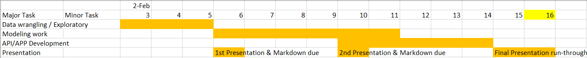

```{r setup, include=FALSE}
knitr::opts_chunk$set(echo = TRUE)
```

## Philly Fire Risk Prediction
1. What is the use case? Why is this important?

Our tool targets the fire department and residents.

The Philadelphia Fire Department responds to hundreds or even thousands of locations everyday to quell an array of emergencies. Currently, they have no ‘situational awareness’ of fire risk for a given location when an emergency call comes in. Therefore, we are going to help them create such a tool, by providing a parcel-level (building) fire risk score prediction for each property in the City; 

In addition, we want to let residents get a real-time update of the fire risk of their houses so they will have a situational awareness on risk for each property citywide


2. What are your exploratory analysis questions?

1 Are there correlations between building fires and features like property age, property type, Code Violations, 311, neighborhood, whether there are elders or infants?

2 how can the features influence the risk of nearby properties?

3 What factors should be set as default parameters for the API routines? And what factors can be acquired dynamically by API?


3. What are the team roles?

Huidi Hu - fire data/model

Zirui Chen, Haoheng Tang - API tasks


4. Gantt chart:

### Load Packages
```{r}
library(tidyverse)
library(sf)
library(QuantPsyc)
library(RSocrata)
library(viridis)
library(caret)
library(spatstat)
library(spdep)
library(FNN)
library(grid)
library(gridExtra)
library(knitr)
library(kableExtra)
library(tidycensus)
library(mapview)
library(httr)
library(dplyr)
library(readxl)
library(stringr)
```


### Standardizing the formatting
```{r}
mapTheme <- function(base_size = 12) {
  theme(
    text = element_text( color = "black"),
    plot.title = element_text(size = 14,colour = "black"),
    plot.subtitle=element_text(face="italic"),
    plot.caption=element_text(hjust=0),
    axis.ticks = element_blank(),
    panel.background = element_blank(),axis.title = element_blank(),
    axis.text = element_blank(),
    axis.title.x = element_blank(),
    axis.title.y = element_blank(),
    panel.grid.minor = element_blank(),
    panel.border = element_rect(colour = "black", fill=NA, size=2)
  )
}

plotTheme <- function(base_size = 12) {
  theme(
    text = element_text( color = "black"),
    plot.title = element_text(size = 14,colour = "black"),
    plot.subtitle = element_text(face="italic"),
    plot.caption = element_text(hjust=0),
    axis.ticks = element_blank(),
    panel.background = element_blank(),
    panel.grid.major = element_line("grey80", size = 0.1),
    panel.grid.minor = element_blank(),
    panel.border = element_rect(colour = "black", fill=NA, size=2),
    strip.background = element_rect(fill = "grey80", color = "white"),
    strip.text = element_text(size=12),
    axis.title = element_text(size=12),
    axis.text = element_text(size=10),
    plot.background = element_blank(),
    legend.background = element_blank(),
    legend.title = element_text(colour = "black", face = "italic"),
    legend.text = element_text(colour = "black", face = "italic"),
    strip.text.x = element_text(size = 14)
  )
}
```

```{r}
# Request OPA for a building-----------------------------------------------
base_url <- "http://api.phila.gov/ais_doc/v1/"
endpoint <- "search/"
#address  <- "4701%20PINE%20ST"
#address  <- "4412E%20WINGOHOCKING%20ST"
#address <- "1955%20GRANITE%20ST"
address <- "1234%20market%20st"
#address <- "1336%20FRIENDSHIP%20ST"

#address  <-"2201N%20BROAD%20ST"
key      <- "?gatekeeperKey=6ba4de64d6ca99aa4db3b9194e37adbf"
url <- paste(base_url, endpoint, address, key, sep="")

# response <- httr::GET("http://api.phila.gov/ais_doc/v1/search/1234%20market%20st?gatekeeperKey=6ba4de64d6ca99aa4db3b9194e37adbf")
response <- httr::GET(url)
tidy_res <- httr::content(response, simplifyVector=TRUE)
length(tidy_res)

glimpse(tidy_res$features)
glimpse(tidy_res$features$properties)
glimpse(tidy_res$features$geometry)
glimpse(tidy_res$features$properties$opa_account_num)
glimpse(tidy_res)
tidy_res$features$properties$opa_account_num
```

```{r}
#Load data------------------------------------------------------------------
fire <- read_excel("./data/fire.xlsx")

fire1 = fire %>%
  filter(addr_type ==1)

fire1$address <- paste(ifelse(is.na(fire1$number)==FALSE,fire1$number,''),
                       "%20",
                       ifelse(is.na(fire1$st_prefix)==FALSE,fire1$st_prefix,''),
                       "%20",
                       ifelse(is.na(fire1$street)==FALSE,fire1$street,''),
                       "%20",
                       ifelse(is.na(fire1$st_type)==FALSE,fire1$st_type,''), sep = "")

fire2 = fire %>%
  filter(addr_type ==2)

fire2$address <- paste(ifelse(is.na(fire2$xst_prefix)==FALSE,fire2$xst_prefix,''),
                       ifelse(fire2$xst_prefix!='',"%20",''),
                       ifelse(is.na(fire2$xstreet)==FALSE,fire2$xstreet,''),
                       "%20",
                       ifelse(is.na(fire2$xst_type)==FALSE,fire2$xst_type,''),
                       "%20",
                       "&",
                       "%20",
                       ifelse(is.na(fire2$st_prefix)==FALSE,fire2$st_prefix,''), 
                       ifelse(fire2$st_prefix!='',"%20",''),
                       ifelse(is.na(fire2$street)==FALSE,fire2$street,''), 
                       "%20",
                       ifelse(is.na(fire2$st_type)==FALSE,fire2$st_type,''),
                       sep = "")  

fireData <- rbind(fire1, fire2)
fireData$MUSA_ID <- paste0("MUSA_",1:nrow(fireData))

api_res <- data.frame(matrix(nrow=nrow(fireData),ncol=1))
colnames(api_res) <- "OPA_Num"
api_res <- cbind(api_res,"MUSA_ID" = fireData$MUSA_ID)
```

### API
```{r}
#Request OPA number for each address-------------------------------------
for (i in 1:nrow(fireData)) {
  # cat(i,"\n")
  address  <- fireData$address[[i]]
  base_url <- "http://api.phila.gov/ais/v1/"
  endpoint <- "search/"
  key      <- "?gatekeeperKey=dc953bbc4ade9d00eabf5409f6d73d3e"
  url <- paste(base_url, endpoint, address, key, sep="")
  response <- httr::GET(url)
  tidy_res <- httr::content(response, simplifyVector=TRUE)
  if (length(tidy_res) != 4){
    if(length(tidy_res$features$properties$opa_account_num)==2)
      opa_num <-  tidy_res$features$properties$opa_account_num[2]
    else
      opa_num <-  tidy_res$features$properties$opa_account_num[1]
  # fireData$opa[[i]] <- tidy_res$features$properties$opa_account_num[1]
    if(is.null(opa_num)){
      opa_num <- "OPA IS NULL"
    } else if(nchar(opa_num)==0) {
      opa_num <- "OPA IS ZERO LENGTH"
    }
    cat("Address",i,"OPA#:",opa_num,"\n")
    api_res[i,"OPA_Num"] <- opa_num
  }else{
    cat("Address",i,"NO ADDRESS FOUND!","\n")
    #fireData$opa[[i]] <- "NULL"
    api_res[i,"OPA_Num"] <- "NONE FOUND"
  }
}

#Request parcel_id for each address-------------------------------------
for (i in 1:nrow(fireData)) {
  address  <- fireData$address[[i]]
  base_url <- "http://api.phila.gov/ais/v1/"
  endpoint <- "search/"
  key      <- "?gatekeeperKey=dc953bbc4ade9d00eabf5409f6d73d3e"
  url <- paste(base_url, endpoint, address, key, sep="")
  response <- httr::GET(url)
  tidy_res <- httr::content(response, simplifyVector=TRUE)
  if (length(tidy_res) != 4){
    if(length(tidy_res$features$properties$dor_parcel_id)==2)
      parcel_id <-  tidy_res$features$properties$dor_parcel_id[2]
    else
      parcel_id <-  tidy_res$features$properties$dor_parcel_id[1]
    if(is.null(parcel_id)){
      parcel_id <- "parcel_id IS NULL"
    } else if(nchar(parcel_id)==0) {
      parcel_id <- "parcel_id IS ZERO LENGTH"
    }
    cat("Address",i,"parcel_id#:",parcel_id,"\n")
    fireData[i,"parcel_id"] <- parcel_id
  }else{
    cat("Address",i,"NO ADDRESS FOUND!","\n")
    fireData[i,"parcel_id"] <- "NONE FOUND"
  }
}

#L&I API---------------------------------------------
base_url <- "https://phl.carto.com/api/v2/"
endpoint <- "sql"
query    <- c("?q=SELECT%20*%20FROM%20violations%20WHERE%20opa_account_num%20=%20")
opa_num  <- paste0("%27",871601760,"%27")
url <- paste(base_url, endpoint, query, opa_num, sep="")

response <- httr::GET(url)
tidy_res <- httr::content(response, simplifyVector=TRUE)$rows

tidy_res
```

```{r}
#L&I Data
violation <- read_csv("./data/violations 2019-2020.csv")
opa <- read_csv("./data/Fire_OPA_Parcel.csv")

fireData <- merge(fireData, opa, by = "MUSA_ID")
names(fireData)[names(fireData) =="OPA_Num"] <-"opa_account_num"
```

## Correlation

### Code violation

```{r}
properties <- read_csv("./data/opa_properties_public.csv")

properties %>%
ggplot(.)+
  geom_point(aes(x = lat, y = lng, 
                 #color = MAE
                 ), 
             fill = "transparent", alpha = 0.4, size=0.1)+
  scale_colour_viridis(direction = -1,
  discrete = FALSE, option = "D")+
  ylim(min(properties$lng), max(properties$lng))+
  xlim(min(properties$lat), max(properties$lat))+
  labs(title="Properties in Philadelphia")+
  mapTheme()
```


```{r}
names(properties)[names(properties) =="parcel_number"] <-"opa_account_num"

properties_vio <- properties %>%
  left_join(violation%>%
              dplyr::select(-lng,-lat,-objectid), by = "opa_account_num")

properties_fire_vio <- properties_vio %>%
  left_join(fireData%>%
              dplyr::select(-zip, -address, -latitude, -longitude ), by = "opa_account_num")
```


```{r}
properties_fire_vio <- properties_fire_vio %>%
  mutate(y = ifelse(is.na(MUSA_ID)==TRUE, "no fire", "fire"),
         code_vio = ifelse(is.na(violationcode)==TRUE, "no code violation", "code violation")
         )

properties_fire_vio %>%
    dplyr::select(y, code_vio) %>%
    gather(Variable, value, -y) %>%
    count(Variable, value, y) %>%
      ggplot(., aes(value, n, fill = y)) +   
        geom_bar(position = "dodge", stat="identity") +
        #facet_wrap(~Variable, scales="free") +
        #scale_fill_manual(values = palette2) +
        labs(x="Code violation", y="Count",
             title = "Feature associations with the likelihood of fire",
             subtitle = "Code Violation") +
        theme(axis.text.x = element_text(hjust = 1)) +
        plotTheme()
        
```

```{r}
lkj <-properties_fire_vio %>%
  mutate(violationcodetitle = ifelse(is.na(violationcodetitle)==TRUE, "NO CODE VIOLATION",violationcodetitle))%>%
  group_by(violationcodetitle) %>%
  summarize(count = n()) 

violation_list <- list("CLIP VIOLATION NOTICE", "HIGH WEEDS-CUT", "EXTERIOR AREA WEEDS",
                       "EXT A-VACANT LOT CLEAN/MAINTAI", "RUBBISH/GARBAGE EXTERIOR-OWNER",
                       "VACANT STRUCTURE LICENSE", "EXTERIOR AREA SANITATION", 
                       "VACANT STRUCTURE & LAND", "UNSAFE STRUCTURE", "INTERIOR SURFACES",
                       "RUBBISH & GARBAGE", "LICENSE - RENTAL PROPERTY","VACANT STRUCTURE AND LAND")
```

```{r}
properties_fire_vio %>%
    filter(violationcodetitle == "CLIP VIOLATION NOTICE" |
          violationcodetitle == "HIGH WEEDS-CUT" |
          violationcodetitle == "EXTERIOR AREA WEEDS" |
          violationcodetitle == "EXT A-VACANT LOT CLEAN/MAINTAI" |
          violationcodetitle == "RUBBISH/GARBAGE EXTERIOR-OWNER" |
          violationcodetitle == "VACANT STRUCTURE LICENSE" |
          violationcodetitle == "EXTERIOR AREA SANITATION" |
          violationcodetitle == "VACANT STRUCTURE & LAND" |
          violationcodetitle == "UNSAFE STRUCTURE" |
          violationcodetitle == "INTERIOR SURFACES" |
          violationcodetitle == "RUBBISH & GARBAGE" |
          violationcodetitle == "LICENSE - RENTAL PROPERTY" |
          violationcodetitle == "VACANT STRUCTURE AND LAND"
           )%>%
    dplyr::select(y, violationcodetitle) %>%
    gather(Variable, value, -y) %>%
    count(Variable, value, y) %>%
      ggplot(., aes(value, n, fill = y)) +   
        geom_bar(position = "dodge", stat="identity") +
        #facet_wrap(~Variable, scales="free") +
        #scale_fill_manual(values = palette2) +
        labs(x="Violation code title", y="Count",
             title = "Feature associations with the likelihood of fire",
             subtitle = "Code Violation") +
        theme(axis.text.x = element_text(angle = 45, hjust = 1,size = 6))+
        plotTheme()
```


```{r}
properties_vio %>%
ggplot(.)+
  geom_point(aes(x = lat, y = lng, 
                 color = violationcode,
                 ), 
             fill = "transparent", alpha = 0.4, size=0.4)+
  scale_colour_viridis(direction = -1,
  discrete = TRUE, option = "D")+
  ylim(min(properties_vio$lng), max(properties_vio$lng))+
  xlim(min(properties_vio$lat), max(properties_vio$lat))+
  labs(title="Code Violations in Philadelphia")+
  mapTheme()+
  theme(legend.position = "none")
```


## spatial

```{r}
nn_function <- function(measureFrom,measureTo,k) {
  measureFrom_Matrix <- as.matrix(measureFrom)
  measureTo_Matrix <- as.matrix(measureTo)
  nn <-   
    get.knnx(measureTo, measureFrom, k)$nn.dist
    output <-
      as.data.frame(nn) %>%
      rownames_to_column(var = "thisPoint") %>%
      gather(points, point_distance, V1:ncol(.)) %>%
      arrange(as.numeric(thisPoint)) %>%
      group_by(thisPoint) %>%
      summarize(pointDistance = mean(point_distance)) %>%
      arrange(as.numeric(thisPoint)) %>% 
      dplyr::select(-thisPoint) %>%
      pull()
    
  return(output)  
}
```


```{r}
request <- read_csv("./data/311 Requests 2019.csv") %>%
  drop_na(lat)

request.sf    <- request %>% 
  st_as_sf(coords = c("lon", "lat"), crs = 4326) %>%
  st_transform('ESRI:102729')

```

```{r}
footprint <- st_read("./data/LI_BUILDING_FOOTPRINTS-shp/LI_BUILDING_FOOTPRINTS.shp")
```

```{r}
footprint.sf <- footprint %>% 
  st_as_sf(coords = st_centroid(footprint.sf), crs = 4326) %>%
  st_transform('ESRI:102729')

st_c <- st_coordinates

footprint.sf <-
  footprint.sf %>% 
  mutate(
    request_nn1 = nn_function(st_c(st_centroid(footprint.sf)), st_c(request.sf), 1)) 
```


```{r}
limit <- 
  st_read("./data/City_Limits-shp/city_limits.shp") %>%
  st_transform(2272)

ggplot() + 
  geom_sf(data = limit)
```


```{r}
fishnet <- 
  st_make_grid(limit, cellsize = 1000) %>%
  st_sf()

fishnet <- 
  fishnet[limit,] %>%
  mutate(uniqueID = rownames(.)) %>%
  dplyr::select(uniqueID)

ggplot() + 
  geom_sf(data = fishnet)
```


```{r}
fire <- 
  read_excel("./data/fire.xlsx")%>%
  #na.omit %>%
  #mutate(latitude = as.numeric(latitude),
  #      longitude = as.numeric(longitude)) %>% 
  #filter(latitude > 0 & 
  #         longitude > 0) %>%
  # dplyr::select(Y = latitude, X = longitude) %>%
  st_as_sf(coords = c("longitude", "latitude"), crs = 4326, agr = "constant")%>%
  st_set_crs(4326) %>%
  st_transform(2272)

fire <- 
  st_intersection(fire, limit)

ggplot() + 
  geom_sf(data = limit) +
  geom_sf(data = fire, colour="red", size=0.1, show.legend = "point") +
  labs(title= "Fire, Philadelphia") +
  mapTheme()
```

```{r}
fire_net <- 
  fire %>% 
  dplyr::select() %>% 
  mutate(countfire = 1) %>% 
  aggregate(., fishnet, sum) %>%
  mutate(countfire = ifelse(is.na(countfire), 0, countfire),
         uniqueID = rownames(.),
         cvID = sample(round(nrow(fishnet) / 24), size=nrow(fishnet), replace = TRUE))

ggplot() +
  geom_sf(data = fire_net, aes(fill = countfire)) +
  scale_fill_viridis() +
  labs(title = "Count of fires for the fishnet") +
  mapTheme()
```

```{r}
type <- fire$descript barplot(prop.table(table(animals)))
hist(type)
```


```{r}
complaints <- 
  st_read("./data/complaints.csv")%>%
  filter(complaintcodename == 'VACANT HOUSE') %>%
  st_as_sf(coords = c("lng", "lat"), crs = 4326, agr = "constant")%>%
  st_set_crs(4326) %>%
  st_transform(2272)

ggplot() + 
  geom_sf(data = chicagoBoundary) +
  geom_sf(data = damage, colour="red", size=0.1, show.legend = "point") +
  labs(title= "complaints") +
  mapTheme()
```

```{r}
fire_building <- 
  fire %>%
  filter(descript == 'Building fire')

fire_building_net <- 
  fire_building %>% 
  dplyr::select() %>% 
  mutate(countfire = 1) %>% 
  aggregate(., fishnet, sum) %>%
  mutate(countfire = ifelse(is.na(countfire), 0, countfire),
         uniqueID = rownames(.),
         cvID = sample(round(nrow(fishnet) / 24), size=nrow(fishnet), replace = TRUE))

ggplot() +
  geom_sf(data = fire_building_net, aes(fill = countfire)) +
  scale_fill_viridis() +
  labs(title = "Count of building fires for the fishnet") +
  mapTheme()
```

