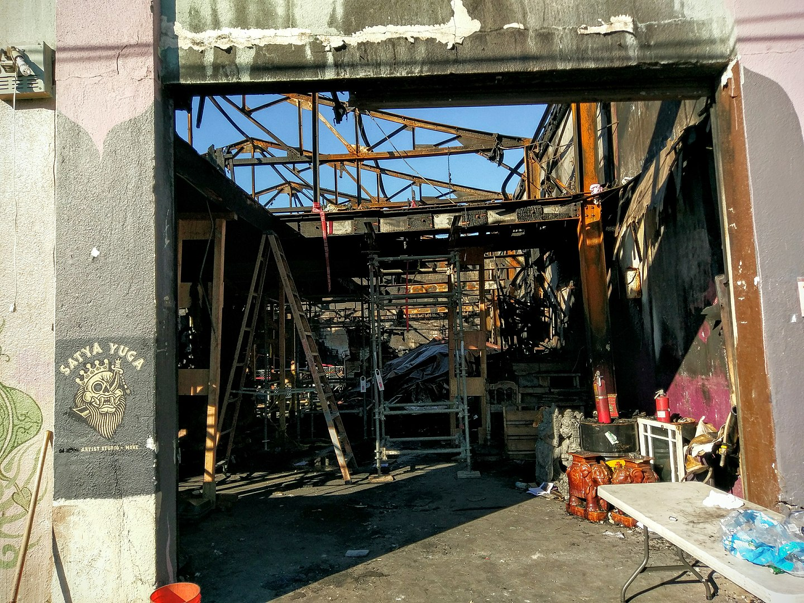

Pre1 - EDA
================

## Use Case

Our tool targets the fire department and residents.

The Philadelphia Fire Department responds to hundreds or even thousands
of locations everyday to quell an array of emergencies. Currently, they
have no ‘situational awareness’ of fire risk for a given location when
an emergency call comes in. Therefore, we are going to help them create
such a tool, by providing a parcel-level (building) fire risk score
prediction for each property in the City;



In addition, we want to let residents get a real-time update of the fire
risk of their houses so they will have a situational awareness on risk
for each property citywide.

``` r
library(tidyverse)
```

    ## -- Attaching packages --------------------------------------------------------------------------------------------- tidyverse 1.3.0 --

    ## v ggplot2 3.2.1     v purrr   0.3.3
    ## v tibble  2.1.3     v dplyr   0.8.3
    ## v tidyr   1.0.2     v stringr 1.4.0
    ## v readr   1.3.1     v forcats 0.4.0

    ## -- Conflicts ------------------------------------------------------------------------------------------------ tidyverse_conflicts() --
    ## x dplyr::filter() masks stats::filter()
    ## x dplyr::lag()    masks stats::lag()

``` r
library(sf)
```

    ## Linking to GEOS 3.6.1, GDAL 2.2.3, PROJ 4.9.3

``` r
library(QuantPsyc)
```

    ## Loading required package: boot

    ## Loading required package: MASS

    ## 
    ## Attaching package: 'MASS'

    ## The following object is masked from 'package:dplyr':
    ## 
    ##     select

    ## 
    ## Attaching package: 'QuantPsyc'

    ## The following object is masked from 'package:base':
    ## 
    ##     norm

``` r
library(RSocrata)
library(viridis)
```

    ## Loading required package: viridisLite

``` r
library(caret)
```

    ## Loading required package: lattice

    ## 
    ## Attaching package: 'lattice'

    ## The following object is masked from 'package:boot':
    ## 
    ##     melanoma

    ## 
    ## Attaching package: 'caret'

    ## The following object is masked from 'package:purrr':
    ## 
    ##     lift

``` r
library(spatstat)
```

    ## Loading required package: spatstat.data

    ## Loading required package: nlme

    ## 
    ## Attaching package: 'nlme'

    ## The following object is masked from 'package:dplyr':
    ## 
    ##     collapse

    ## Loading required package: rpart

    ## Registered S3 method overwritten by 'spatstat':
    ##   method     from
    ##   print.boxx cli

    ## 
    ## spatstat 1.63-0       (nickname: 'Space camouflage') 
    ## For an introduction to spatstat, type 'beginner'

    ## 
    ## Note: R version 3.6.2 (2019-12-12) is more than a year old; we strongly recommend upgrading to the latest version

    ## 
    ## Attaching package: 'spatstat'

    ## The following object is masked from 'package:lattice':
    ## 
    ##     panel.histogram

    ## The following object is masked from 'package:MASS':
    ## 
    ##     area

    ## The following object is masked from 'package:boot':
    ## 
    ##     envelope

``` r
library(spdep)
```

    ## Loading required package: sp

    ## Loading required package: spData

    ## To access larger datasets in this package, install the spDataLarge
    ## package with: `install.packages('spDataLarge',
    ## repos='https://nowosad.github.io/drat/', type='source')`

``` r
library(FNN)
library(grid)
library(gridExtra)
```

    ## 
    ## Attaching package: 'gridExtra'

    ## The following object is masked from 'package:dplyr':
    ## 
    ##     combine

``` r
library(knitr)
library(kableExtra)
```

    ## 
    ## Attaching package: 'kableExtra'

    ## The following object is masked from 'package:dplyr':
    ## 
    ##     group_rows

``` r
library(tidycensus)

mapTheme <- function(base_size = 12) {
  theme(
    text = element_text( color = "black"),
    plot.title = element_text(size = 14,colour = "black"),
    plot.subtitle=element_text(face="italic"),
    plot.caption=element_text(hjust=0),
    axis.ticks = element_blank(),
    panel.background = element_blank(),axis.title = element_blank(),
    axis.text = element_blank(),
    axis.title.x = element_blank(),
    axis.title.y = element_blank(),
    panel.grid.minor = element_blank(),
    panel.border = element_rect(colour = "black", fill=NA, size=2)
  )
}

#Nearest neighbor (NND) function
nn_function <- function(measureFrom,measureTo,k) {
  measureFrom_Matrix <-
    as.matrix(measureFrom)
  measureTo_Matrix <-
    as.matrix(measureTo)
  nn <-   
    get.knnx(measureTo, measureFrom, k)$nn.dist
  output <-
    as.data.frame(nn) %>%
    rownames_to_column(var = "thisPoint") %>%
    gather(points, point_distance, V1:ncol(.)) %>%
    arrange(as.numeric(thisPoint)) %>%
    group_by(thisPoint) %>%
    dplyr::summarize(pointDistance = mean(point_distance)) %>%
    arrange(as.numeric(thisPoint)) %>% 
    dplyr::select(-thisPoint) %>%
    pull()
  return(output)  
}
```

``` r
#Load data------------------------------------------------------------------
library(readxl)
fire <- read_excel("./data/fire.xlsx")
```

    ## Warning in read_fun(path = enc2native(normalizePath(path)), sheet_i = sheet, :
    ## Expecting logical in J2144 / R2144C10: got 'N'

    ## Warning in read_fun(path = enc2native(normalizePath(path)), sheet_i = sheet, :
    ## Expecting logical in K2929 / R2929C11: got 'Tioga Marine Terminal'

    ## Warning in read_fun(path = enc2native(normalizePath(path)), sheet_i = sheet, :
    ## Expecting logical in K3678 / R3678C11: got '6543 WOODSTOCK ST.'

    ## Warning in read_fun(path = enc2native(normalizePath(path)), sheet_i = sheet, :
    ## Expecting logical in K4214 / R4214C11: got 'Bldg. 8'

    ## Warning in read_fun(path = enc2native(normalizePath(path)), sheet_i = sheet, :
    ## Expecting logical in K4362 / R4362C11: got 'AKA 5550 Whitaker Ave.'

    ## Warning in read_fun(path = enc2native(normalizePath(path)), sheet_i = sheet, :
    ## Expecting logical in J4593 / R4593C10: got 'S'

    ## Warning in read_fun(path = enc2native(normalizePath(path)), sheet_i = sheet, :
    ## Expecting logical in K5264 / R5264C11: got 'Bldg. D'

    ## Warning in read_fun(path = enc2native(normalizePath(path)), sheet_i = sheet, :
    ## Expecting logical in K5499 / R5499C11: got '6525 N. 6th St'

    ## Warning in read_fun(path = enc2native(normalizePath(path)), sheet_i = sheet, :
    ## Expecting logical in J6421 / R6421C10: got 'S'

    ## Warning in read_fun(path = enc2native(normalizePath(path)), sheet_i = sheet, :
    ## Expecting logical in K8402 / R8402C11: got '6817 HORROCKS'

    ## Warning in read_fun(path = enc2native(normalizePath(path)), sheet_i = sheet, :
    ## Expecting logical in K9521 / R9521C11: got 'BLDG A'

    ## Warning in read_fun(path = enc2native(normalizePath(path)), sheet_i = sheet, :
    ## Expecting logical in J9591 / R9591C10: got 'S'

    ## Warning in read_fun(path = enc2native(normalizePath(path)), sheet_i = sheet, :
    ## Expecting logical in K10826 / R10826C11: got '4711 Cooper St.'

    ## Warning in read_fun(path = enc2native(normalizePath(path)), sheet_i = sheet, :
    ## Expecting logical in K11463 / R11463C11: got 'Levin Bldg'

    ## Warning in read_fun(path = enc2native(normalizePath(path)), sheet_i = sheet, :
    ## Expecting logical in K12803 / R12803C11: got '5511 Hazel Av'

    ## Warning in read_fun(path = enc2native(normalizePath(path)), sheet_i = sheet, :
    ## Expecting logical in K13583 / R13583C11: got 'Super Clean At Erie'

    ## Warning in read_fun(path = enc2native(normalizePath(path)), sheet_i = sheet, :
    ## Expecting logical in K13972 / R13972C11: got 'Building CE'

    ## Warning in read_fun(path = enc2native(normalizePath(path)), sheet_i = sheet, :
    ## Expecting logical in K14469 / R14469C11: got 'Building C'

    ## Warning in read_fun(path = enc2native(normalizePath(path)), sheet_i = sheet, :
    ## Expecting logical in J14713 / R14713C10: got 'S'

    ## Warning in read_fun(path = enc2native(normalizePath(path)), sheet_i = sheet, :
    ## Expecting logical in J15966 / R15966C10: got 'S'

    ## Warning in read_fun(path = enc2native(normalizePath(path)), sheet_i = sheet, :
    ## Expecting logical in K19588 / R19588C11: got '6522 Vine Street'

    ## Warning in read_fun(path = enc2native(normalizePath(path)), sheet_i = sheet, :
    ## Expecting logical in K20186 / R20186C11: got '3200 TULIP ST'

    ## Warning in read_fun(path = enc2native(normalizePath(path)), sheet_i = sheet, :
    ## Expecting logical in K21224 / R21224C11: got '1121 N 66th Street'

    ## Warning in read_fun(path = enc2native(normalizePath(path)), sheet_i = sheet, :
    ## Expecting logical in K21257 / R21257C11: got 'BLDG "O"'

    ## Warning in read_fun(path = enc2native(normalizePath(path)), sheet_i = sheet, :
    ## Expecting logical in K21385 / R21385C11: got 'Building 67'

    ## Warning in read_fun(path = enc2native(normalizePath(path)), sheet_i = sheet, :
    ## Expecting logical in J22225 / R22225C10: got 'S'

    ## Warning in read_fun(path = enc2native(normalizePath(path)), sheet_i = sheet, :
    ## Expecting logical in K23578 / R23578C11: got '6522 Vine Street'

    ## Warning in read_fun(path = enc2native(normalizePath(path)), sheet_i = sheet, :
    ## Expecting logical in K23600 / R23600C11: got '2012 Sanford St, (Address of
    ## Fire)'

    ## Warning in read_fun(path = enc2native(normalizePath(path)), sheet_i = sheet, :
    ## Expecting logical in K26414 / R26414C11: got '3200 TULIP ST'

    ## Warning in read_fun(path = enc2native(normalizePath(path)), sheet_i = sheet, :
    ## Expecting logical in K28259 / R28259C11: got 'Glicks Rib Shack'

    ## Warning in read_fun(path = enc2native(normalizePath(path)), sheet_i = sheet, :
    ## Expecting logical in K30488 / R30488C11: got '531-51 E WASHINGTON LN'

    ## Warning in read_fun(path = enc2native(normalizePath(path)), sheet_i = sheet, :
    ## Expecting logical in K30709 / R30709C11: got '10149 VERREE'

    ## Warning in read_fun(path = enc2native(normalizePath(path)), sheet_i = sheet, :
    ## Expecting logical in K31503 / R31503C11: got '1837 Dudley St.'

    ## Warning in read_fun(path = enc2native(normalizePath(path)), sheet_i = sheet, :
    ## Expecting logical in K31757 / R31757C11: got '6522 Vine Street'

    ## Warning in read_fun(path = enc2native(normalizePath(path)), sheet_i = sheet, :
    ## Expecting logical in K32275 / R32275C11: got 'McDonalds'

    ## Warning in read_fun(path = enc2native(normalizePath(path)), sheet_i = sheet, :
    ## Expecting logical in K32597 / R32597C11: got '1400 N. Broad St'

``` r
library(stringr)

fire1 = fire %>%
  filter(addr_type ==1)
fire1$address <- paste(ifelse(is.na(fire1$number)==FALSE,fire1$number,''),
                       "%20",
                       ifelse(is.na(fire1$st_prefix)==FALSE,fire1$st_prefix,''),
                       "%20",
                       ifelse(is.na(fire1$street)==FALSE,fire1$street,''),
                       "%20",
                       ifelse(is.na(fire1$st_type)==FALSE,fire1$st_type,''), sep = "")
fire2 = fire %>%
  filter(addr_type ==2)
fire2$address <- paste(ifelse(is.na(fire2$xst_prefix)==FALSE,fire2$xst_prefix,''),
                       ifelse(fire2$xst_prefix!='',"%20",''),
                       ifelse(is.na(fire2$xstreet)==FALSE,fire2$xstreet,''),
                       "%20",
                       ifelse(is.na(fire2$xst_type)==FALSE,fire2$xst_type,''),
                       "%20",
                       "&",
                       "%20",
                       ifelse(is.na(fire2$st_prefix)==FALSE,fire2$st_prefix,''), 
                       ifelse(fire2$st_prefix!='',"%20",''),
                       ifelse(is.na(fire2$street)==FALSE,fire2$street,''), 
                       "%20",
                       ifelse(is.na(fire2$st_type)==FALSE,fire2$st_type,''),
                       sep = "")  
fireData <- rbind(fire1, fire2)

fireData$MUSA_ID <- paste0("MUSA_",1:nrow(fireData))
```

## Building Features

In this part, we looked into all the properties in philadelphia to examine whether there is a higher percentage of fire occurrence in the properties with certain features. 


``` r
###loading opa & property data
opa <- read_csv("data/Fire_OPA_Parcel.csv")
```

    ## Warning: Missing column names filled in: 'X1' [1]

    ## Parsed with column specification:
    ## cols(
    ##   X1 = col_double(),
    ##   OPA_Num = col_character(),
    ##   Parcel_Id = col_character(),
    ##   MUSA_ID = col_character()
    ## )

``` r
property <- read_csv("data/opa_properties_public.csv")
```

    ## Parsed with column specification:
    ## cols(
    ##   .default = col_character(),
    ##   assessment_date = col_datetime(format = ""),
    ##   category_code = col_double(),
    ##   date_exterior_condition = col_datetime(format = ""),
    ##   depth = col_double(),
    ##   exempt_building = col_double(),
    ##   exempt_land = col_double(),
    ##   exterior_condition = col_double(),
    ##   fireplaces = col_double(),
    ##   frontage = col_double(),
    ##   garage_spaces = col_double(),
    ##   homestead_exemption = col_double(),
    ##   interior_condition = col_double(),
    ##   market_value = col_double(),
    ##   market_value_date = col_logical(),
    ##   number_of_bathrooms = col_double(),
    ##   number_of_bedrooms = col_double(),
    ##   number_of_rooms = col_double(),
    ##   number_stories = col_double(),
    ##   off_street_open = col_double(),
    ##   other_building = col_logical()
    ##   # ... with 14 more columns
    ## )

    ## See spec(...) for full column specifications.

    ## Warning: 4217 parsing failures.
    ##  row            col           expected actual                             file
    ## 2409 other_building 1/0/T/F/TRUE/FALSE      N 'data/opa_properties_public.csv'
    ## 3391 other_building 1/0/T/F/TRUE/FALSE      N 'data/opa_properties_public.csv'
    ## 4876 other_building 1/0/T/F/TRUE/FALSE      N 'data/opa_properties_public.csv'
    ## 7070 unfinished     1/0/T/F/TRUE/FALSE      U 'data/opa_properties_public.csv'
    ## 7071 unfinished     1/0/T/F/TRUE/FALSE      U 'data/opa_properties_public.csv'
    ## .... .............. .................. ...... ................................
    ## See problems(...) for more details.

``` r
property <- rename(property, OPA_Num = parcel_number)
fire_opa <- left_join(fireData,opa,by='MUSA_ID')
property_fire <- left_join(property,fire_opa,by='OPA_Num')
```

``` r
##Feature engineering
fire_property_trim <-mutate(property_fire, category = case_when(
  category_code == 1  ~ "Residential",
  category_code == 2  ~ "Hotels and Apartments",
  category_code == 3  ~ "Store with Dwelling",
  category_code == 4  ~ "Commercial",
  category_code == 5  ~ "Industrial",
  category_code == 6  ~ "Vacant Land"))
fire_property_trim <-mutate(fire_property_trim, interior = case_when(
  interior_condition == 0  ~ "Not Applicable",
  interior_condition == 2  ~ "New/Rehabbed",
  interior_condition == 3  ~ "Above Average",
  interior_condition == 4  ~ "Average",
  interior_condition == 5  ~ "Below Average",
  interior_condition == 6  ~ "Vacant",
  interior_condition == 7  ~ "Sealed / Structurally Compromised"))
fire_property_trim$year_built <- as.numeric(as.character(fire_property_trim$year_built))
```

    ## Warning: NAs introduced by coercion

``` r
fire_property_trim <-mutate(fire_property_trim, year_built_cat = case_when(
  year_built >= 1600 & year_built < 1800 ~ "1600-1800",
  year_built >= 1800 & year_built < 1900 ~ "1800s",
  year_built >= 1900 & year_built < 2000  ~ "1900s",
  year_built >= 2000 & year_built < 2010  ~ "2000-2010",
  year_built >= 2010 & year_built < 2020  ~ "2010-2020",
  year_built < 1000 | year_built >2020 ~ "Unknown"))
fire_property_trim <-mutate(fire_property_trim, isfire = case_when(
  is.na(inci_no) == FALSE  ~ "Have fire",
  is.na(inci_no) == TRUE  ~ "No fire"))
###EDA plot
#category
fire_property_trim  %>% 
  ggplot(aes(x = category, fill = isfire)) + 
  geom_bar(position = position_fill()) + 
  theme_classic() + 
  labs(y = 'Percent') + 
  coord_flip() #rotate the axis
```

<!-- -->

``` r
#zoning
fire_property_trim  %>% 
  ggplot(aes(x = zoning, fill = isfire)) + 
  geom_bar(position = position_fill()) + 
  theme_classic() + 
  labs(y = 'Percent') + 
  coord_flip() 
```

<!-- -->

``` r
#interior
fire_property_trim  %>% 
  ggplot(aes(x = interior, fill = isfire)) + 
  geom_bar(position = position_fill()) + 
  theme_classic() + 
  labs(y = 'Percent') + 
  coord_flip() 
```

<!-- -->

``` r
#year build
fire_property_trim  %>% 
  ggplot(aes(x = year_built_cat, fill = isfire)) + 
  geom_bar(position = position_fill()) + 
  theme_classic() + 
  labs(y = 'Percent') + 
  coord_flip() 
```

<!-- -->

As to property category, there is a higher percentage of fire occurrence in commercial, hotels and apartments properties.

As to different zoning type. There is significantly higher propertion of fire occurred in the buildings of SPENT category. 

Slightly more fire occurred in the properties which are sealed or structurally compromised.

There is no significant difference for fire occurrence in properties with different age.

## Environment Factors

(Haoheng’s text)

## Previous Fire

The third risk factor is the spatial correlation of fire incidents. To
understand if fires have a tendency to cluster in Philadelphia, we
examined the average distance to 5 nearest fire event for each parcel.
The results indicate that buildings with a smaller distance to past
fires have a higher risk for future fire event.

``` r
limit <- 
  st_read("./data/City_Limits-shp/city_limits.shp") %>%
  st_transform(2272)
```

    ## Reading layer `city_limits' from data source `C:\Users\sofia\550\MUSA801\data\City_Limits-shp\city_limits.shp' using driver `ESRI Shapefile'
    ## Simple feature collection with 1 feature and 3 fields
    ## geometry type:  POLYGON
    ## dimension:      XY
    ## bbox:           xmin: -75.28031 ymin: 39.86747 xmax: -74.95575 ymax: 40.13793
    ## epsg (SRID):    4326
    ## proj4string:    +proj=longlat +datum=WGS84 +no_defs

``` r
ggplot() + 
  geom_sf(data = limit)
```

<!-- -->

``` r
# load the fire data
fire.sf <- 
  property_fire%>% 
  filter(lat < 0 & lng > 0) %>%
  st_as_sf(coords = c("lat", "lng"), crs = 4326, agr = "constant") %>%
  st_set_crs(4326) %>%
  st_transform(2272)

fire.sf <- 
  st_intersection(fire.sf, limit)
```

    ## Warning: attribute variables are assumed to be spatially constant throughout all
    ## geometries

``` r
library(lubridate)
```

    ## 
    ## Attaching package: 'lubridate'

    ## The following object is masked from 'package:base':
    ## 
    ##     date

``` r
fire.sf <- 
  fire.sf %>%
  mutate(date=dmy(alm_date),
         Year=year(date),
         Month=month(date))

fire.sf_19 <- fire.sf[fire.sf$Year==2019,]
fire.sf_192 <- fire.sf_19[!is.na(fire.sf_19$Year),]

fire.sf_18 <- fire.sf[fire.sf$Year==2018,]
fire.sf_182 <- fire.sf_18[!is.na(fire.sf_18$Year),]

fire.sf_17 <- fire.sf[fire.sf$Year==2017,]
fire.sf_172 <- fire.sf_18[!is.na(fire.sf_17$Year),]
```

    ## Warning: Length of logical index must be 1 or 570669, not 568806

``` r
fire.sf_16 <- fire.sf[fire.sf$Year==2016,]
fire.sf_162 <- fire.sf_18[!is.na(fire.sf_16$Year),]
```

    ## Warning: Length of logical index must be 1 or 570669, not 569017

``` r
fire.sf_15 <- fire.sf[fire.sf$Year==2015,]
fire.sf_152 <- fire.sf_18[!is.na(fire.sf_15$Year),]
```

    ## Warning: Length of logical index must be 1 or 570669, not 569265

``` r
# the distance from the nearest 5 fires to the center of the grid for each year(2015-2018)
fire.sf$lagfire19.nn5 <-nn_function(st_coordinates(fire.sf),st_coordinates(fire.sf_192),5) 
fire.sf$lagfire18.nn5 <-nn_function(st_coordinates(fire.sf),st_coordinates(fire.sf_182),5) 
#fire.sf$lagfire17.nn5 <-nn_function(st_coordinates(fire.sf),st_coordinates(fire.sf_172),5) 
#fire.sf$lagfire16.nn5 <-nn_function(st_coordinates(fire.sf),st_coordinates(fire.sf_162),5) 
#fire.sf$lagfire15.nn5 <-nn_function(st_coordinates(fire.sf),st_coordinates(fire.sf_152),5) 
```

``` r
fire_property_trim <-mutate(fire.sf, isfire = case_when(
  is.na(inci_no) == FALSE  ~ "Have fire",
  is.na(inci_no) == TRUE  ~ "No fire"))

fire_property_trim %>%
    ggplot(aes(isfire, lagfire19.nn5, fill=isfire)) + 
      geom_bar(position = "dodge", stat = "summary", fun.y = "mean") + 
      #scale_fill_manual(values = palette2) +
      labs(x="isfire", y="Value", 
           title = "Nearby fire associations with the likelihood of fire (2019, nearest 5)",
           subtitle = "(continous outcomes)") +
      theme(legend.position = "none")
```

<!-- -->

``` r
fire.sample <- fire.sf[sample(nrow(fire.sf), 3000), ]

ggplot() + 
  geom_sf(data = limit) +
  geom_sf(data = fire.sample, colour="red", size=0.1, show.legend = "point") +
  labs(title= "Fire, Philadelphia") +
  mapTheme()
```

<!-- -->

``` r
fire.sf_182.sample <- fire.sf_182[sample(nrow(fire.sf_182), 3000), ]
fire.sf_192.sample <- fire.sf_192[sample(nrow(fire.sf_192), 3000), ]

ggplot() + 
  geom_sf(data = limit) +
  geom_sf(data = fire.sf_182.sample, colour="firebrick1", size=0.1, show.legend = "point") +
  geom_sf(data = fire.sf_192.sample, colour="firebrick4", size=0.1, show.legend = "point") +
  labs(title= "Fire 2018/2019, Philadelphia") +
  mapTheme()
```

<!-- -->

``` r
fire.sf_b <- fire.sf%>%filter(descript == 'Building fire')

fire.sf_n <- fire.sf%>%filter(descript != 'Building fire')
#fire.sf_n.sample <- fire.sf_n[sample(nrow(fire.sf_192), 3000), ]

ggplot() + 
  geom_sf(data = limit) +
  geom_sf(data = fire.sf_b, colour="red", size=0.1, show.legend = "point") +
  geom_sf(data = fire.sf_n, colour="grey", size=0.1, show.legend = "point") +
  labs(title= "Building fire, Philadelphia") +
  mapTheme()
```

<!-- -->

## Next Steps

  - Model
  - API


